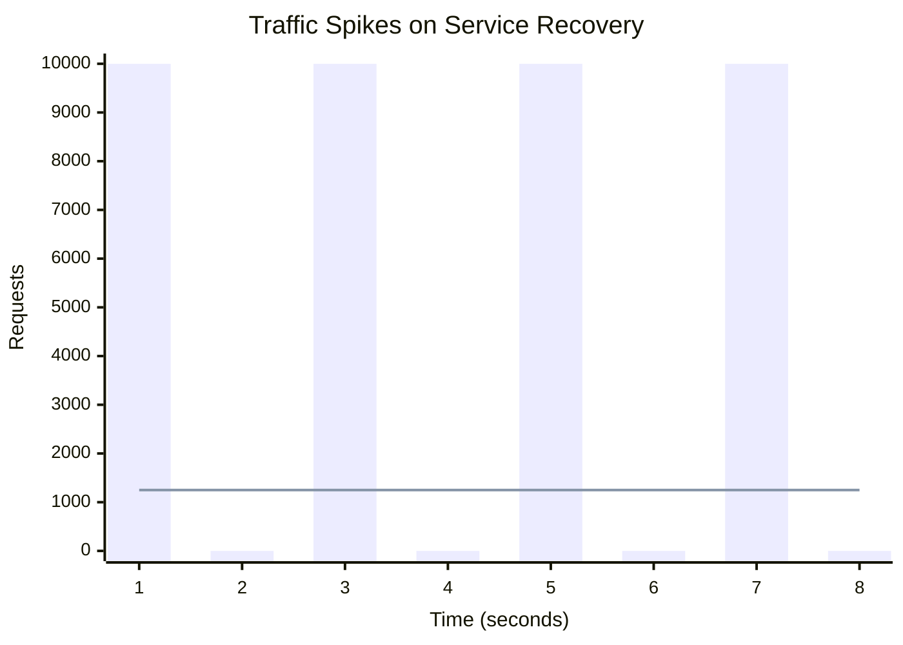

# Resilient Microservices: Exponential Backoff and Jitter Algorithms

## The Problem: The Thundering Herd
In a distributed microservice architecture, transient failures are a mathematical certainty. A downstream database might momentarily restart, a network switch might drop packets, or an API rate limit might be briefly exceeded. 

The naive solution is to wrap the failing network call in a `while` loop and immediately retry:

```python
# The Naive Retry (Anti-pattern)
while retries < 3:
    try:
        return make_http_call()
    except NetworkError:
        retries += 1
```

If a downstream service is down for 5 seconds, and 10,000 clients are constantly hammering it with immediate retries, the system experiences a **Thundering Herd**. When the service finally reboots, it is instantly crushed by 30,000 pending requests, immediately crashing it again. 

## The Mental Model: Exponential Backoff + Jitter
To allow a struggling service to recover, clients must back off. **Exponential backoff** means increasing the wait time between each retry exponentially (e.g., wait 1s, then 2s, then 4s, then 8s).

However, exponential backoff alone is not enough. If 10,000 clients all fail at the exact same millisecond, they will all wait exactly 1 second, and then hammer the service simultaneously. They will fail again, wait exactly 2 seconds, and hammer it again. 

To solve this, we must introduce **Jitter**—randomness. By injecting random noise into the backoff calculation, we smear the retries across a broad window of time, flattening the spike in traffic.

### Visualizing the Load


*(The bars represent pure exponential backoff. The flat line represents backoff with Jitter).*

## Implementation: The "Full Jitter" Algorithm
There are several ways to calculate jitter. Amazon Web Services (AWS) conducted extensive research on this and concluded that the **Full Jitter** algorithm yields the best results for minimizing completion time while drastically reducing server load.

The formula is:
`sleep_time = random_between(0, min(cap, base * 2 ^ attempt))`

### Python Code Example

```python
import time
import random
import requests

def make_request_with_retry(url, max_retries=5, base_ms=100, cap_ms=10000):
    attempt = 0
    
    while True:
        try:
            response = requests.get(url, timeout=5)
            response.raise_for_status()
            return response.json()
            
        except (requests.exceptions.RequestException) as e:
            attempt += 1
            if attempt > max_retries:
                raise Exception(f"Failed after {max_retries} attempts.") from e
            
            # Calculate the exponential backoff (e.g., 100, 200, 400, 800)
            exponential_backoff = base_ms * (2 ** attempt)
            
            # Cap the maximum sleep time to avoid waiting forever
            capped_backoff = min(cap_ms, exponential_backoff)
            
            # Apply Full Jitter: random number between 0 and the capped backoff
            sleep_ms = random.uniform(0, capped_backoff)
            
            print(f"Attempt {attempt} failed. Sleeping for {sleep_ms:.2f} ms")
            time.sleep(sleep_ms / 1000.0)
```

### Why Idempotency is Critical
A retry mechanism is incredibly dangerous if the operation is not **idempotent**. 

If an HTTP POST request to `/charge-credit-card` fails due to a network timeout, the client doesn't know if the server failed *before* or *after* it charged the card. If the client retries, the user might be charged twice.

To safely use retries on state-mutating operations, you must include an **Idempotency Key** (a unique UUID) in the request header. The server must check if it has already processed that key before executing the logic.

```python
headers = {
    "Idempotency-Key": "d8e8fca2-1ea0-11eb-adc1-0242ac120002"
}
requests.post("/charge", headers=headers, json=payload)
```

## Summary
Building resilient microservices requires assuming the network will fail. Immediate retries weaponize your own infrastructure against you. By implementing Exponential Backoff with Full Jitter, you give downstream dependencies the breathing room they need to recover. Couple this with strict API idempotency, and you create robust, self-healing distributed systems.