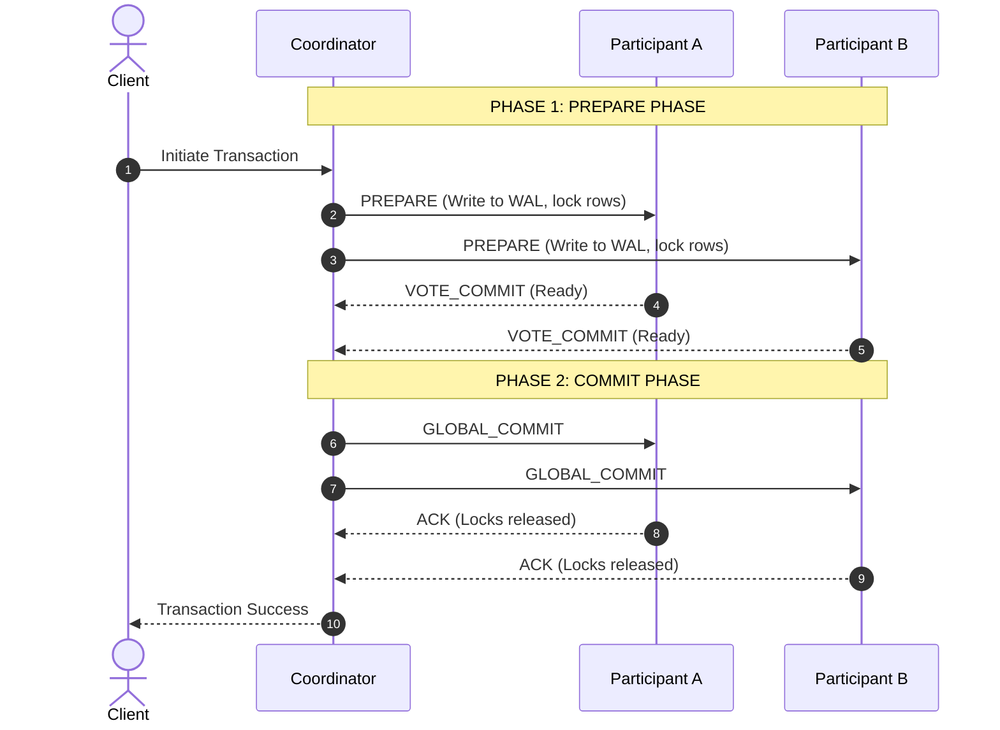

# Distributed Transactions: The Saga Pattern (Choreography vs. Orchestration) vs. Two-Phase Commit (2PC)

> Master the architectural patterns of data consistency in distributed systems. Analyze the locking, blocking mechanics of Two-Phase Commit (2PC) and learn how to design highly scalable, event-driven Choreographed and Orchestrated Sagas with idempotent, resilient compensating transactions.

---

## What We Are Going to Learn

In this deep-dive guide, we will solve the ultimate challenge of distributed systems: preserving data consistency when business processes span multiple databases.

Specifically, we will cover:
1. **The Death of ACID:** Why standard database-level transactions fail completely in a decentralized microservices mesh.
2. **Two-Phase Commit (2PC):** The mechanics of the Coordinator model, Prepare/Commit phases, and why it acts as a blocking, high-latency anti-pattern in modern cloud architectures.
3. **The Saga Pattern:** How to stage a sequence of local transactions and execute idempotent, commutative compensating actions to undo mutations upon failure.
4. **Decentralized Choreography vs. Centralized Orchestration:** Evaluating event-driven sagas (Kafka) against workflow orchestrators (Temporal, AWS Step Functions).
5. **Resilient Compensating Design:** Under-the-hood strategies for maintaining idempotency, handling out-of-order events, and surviving transaction race conditions.
6. **Hands-on Production Code:** A complete, runnable Python sequence implementing an Orchestration Saga with automatic rollback and idempotency guards.
7. **The Transactional Outbox Pattern:** Guaranteeing atomic local database writes and event publishing to eliminate dual-write inconsistencies.

---

## The Problem: The Collapse of ACID in Microservices

In a traditional monolithic application, maintaining data consistency is trivial. When a customer checks out, the backend initiates a single database transaction. The application inserts an order, updates inventory, and registers a payment within an ACID boundary:

```sql
BEGIN TRANSACTION;
  INSERT INTO orders (id, user_id, total) VALUES (101, 99, 150.00);
  UPDATE inventory SET stock = stock - 1 WHERE item_sku = 'SKU-MACBOOK';
  INSERT INTO payments (id, order_id, status) VALUES (202, 101, 'COMPLETED');
COMMIT; -- If any line fails, the database engine rolls back all mutations automatically.
```

The database engine enforces **Atomicity** (all-or-nothing), **Consistency** (state transitions are valid), **Isolation** (concurrent transactions do not interfere), and **Durability** (survives crashes).

However, in a microservices architecture, you must adhere to the **Database-per-Service** pattern to prevent tight database coupling. Each service owns its dedicated database, which may run on entirely different engines (e.g., Postgres for Orders, MongoDB for Inventory, and DynamoDB for Payments).

```
                      +-------------------------+
                      |   Client Checkout Request
                      +-------------------------+
                                   |
                                   v
                      +-------------------------+
                      |      Order Service      | ---> [ Postgres DB ]
                      +-------------------------+
                                   |
                                   v
                      +-------------------------+
                      |    Inventory Service    | ---> [ MongoDB ]
                      +-------------------------+
                                   |
                                   v
                      +-------------------------+
                      |     Payment Service     | ---> [ DynamoDB ]
                      +-------------------------+
```

### The Transactional Failure State
When a customer checks out:
1. The **Order Service** creates an order record (`PENDING`).
2. The **Inventory Service** successfully decrements the item's stock.
3. The **Payment Service** attempts to charge the credit card, but the transaction is **declined** due to insufficient funds.

Because the operations occur over separate network calls across decoupled databases, **you cannot execute a standard SQL rollback**. 
* The **Order Service** has already committed its write.
* The **Inventory Service** has already committed its write.
* The system is now left in an **inconsistent, illegal state**: stock has been reserved for an order that can never be paid for.

This is the distributed transaction problem. How do we guarantee that all services eventually commit, or all services roll back, without violating the architectural independence of our microservices?

---

## Why the Problem Is Hard: The Fallacy of Database Locks

We cannot simply lock external databases over network boundaries. To do so introduces three fatal architectural hazards:

1. **The Critical Path Latency Inflation:** If Service A locks a row in Database A, and then calls Service B over HTTP to lock a row in Database B, Database A's lock remains held for the entire duration of the network round-trip. This network-bound lock holding reduces throughput by orders of magnitude:
   
   $$\text{Throughput} \propto \frac{1}{\text{Network Round Trip Time}}$$
   
   Under high traffic, thread pools exhaust instantly, database connection pools saturate, and the entire system cascades into a complete freeze.
2. **The Dual-Write Dilemma:** You cannot atomically write to a local database and publish a message to an external broker (like Apache Kafka) in a single step. If the database write succeeds but the network fails before publishing, downstream services never receive the event. If you publish first and the database write fails, downstream services process a ghost event.
3. **The CAP Theorem Hard Boundary:** The CAP theorem dictates that during a network partition ($P$), a distributed system must choose between Consistency ($C$) and Availability ($A$). Attempting to force absolute, immediate consistency across multiple network-isolated services means you must fail closed (shutting down the system) when any single node or network link degrades. For high-volume internet platforms, this is economically unacceptable; we must design for eventual consistency.

---

## A Simple Mental Model: The Strict Wedding vs. The Travel Agent

To understand the two primary ways to coordinate distributed consistency, let's build two contrasting real-world mental models.

```
       [ Two-Phase Commit (2PC) ]                    [ The Saga Pattern ]
      "The Highly Synchronized Wedding"             "The Flexible Travel Agent"
  ==========================================    ==========================================
  Coordinator: "Do you take this spouse?"       Step 1: Book flight (Committed)
  Guest 1: "I agree."                           Step 2: Book hotel (Committed)
  Guest 2: "I agree."                           Step 3: Rent car (FAILED!)
  Coordinator: "We are officially married."      ------------------------------------------
  *If one guest objects, wedding is aborted.    Compensate 2: Cancel hotel & get refund.
  *No one can leave their seat until committed.  Compensate 1: Cancel flight & get refund.
```

### 1. Two-Phase Commit (2PC) — The Synchronized Wedding
In 2PC, all participants are locked in place. A central coordinator asks every node: *"Are you ready to commit?"* Every node must reply *"Yes"*. While they wait for the final decree, all participants hold onto their locks. If a single node is silent or says *"No"*, the coordinator orders everyone to abort. Nobody can change their state independently. It is highly consistent, but fragile, slow, and completely blocking.

### 2. The Saga Pattern — The Flexible Travel Agent
In a Saga, you do not lock anything. Instead, you act like a travel agent booking a vacation. 
1. First, the agent charges your card for the flight. The airline books the seat and commits the transaction immediately.
2. Next, the agent attempts to book the hotel room. The hotel database commits.
3. Finally, the agent tries to book the rental car, but finds that no cars are available.

The travel agent does not freeze time or undo the flight booking using a database rollback. Instead, they execute **compensating actions**: they refund the hotel room and cancel the flight. The money goes back to your card, the seat is released, and the system eventually returns to its starting state.

---

## Under the Hood: Two-Phase Commit (2PC) Mechanics

Two-Phase Commit (2PC) is a strongly consistent protocol ($CP$ in CAP) designed to achieve atomic commitment across multiple databases. It operates via a centralized **Coordinator** and multiple **Participants** (resource managers/databases) in two sequential phases.

### Phase 1: The Prepare Phase
1. The Coordinator generates a global transaction ID.
2. The Coordinator sends a `PREPARE` command over the network to all Participants.
3. Each Participant opens a local transaction, acquires necessary row locks, writes its changes to a local Write-Ahead Log (WAL), and executes the work up to the point of commit.
4. If successful, the Participant responds with `VOTE_COMMIT` and holds its locks. If it fails, it responds with `VOTE_ABORT`.

### Phase 2: The Commit Phase
* **Scenario A (All Vote Yes):** The Coordinator receives `VOTE_COMMIT` from *every* participant. It writes a commit record to its own WAL and sends a `GLOBAL_COMMIT` command to all Participants. Each Participant commits its local transaction, releases all locks, and sends an `ACK`.
* **Scenario B (Any Vote No or Timeout):** If any Participant votes `VOTE_ABORT`, or if the Coordinator times out waiting for a vote, the Coordinator writes an abort record to its WAL and sends a `GLOBAL_ABORT` command. Each Participant rolls back its local transaction and releases its locks.



### Why 2PC is a Cloud Anti-Pattern (The Architectural Vulnerabilities)

While mathematically elegant, 2PC is fundamentally unsuited for modern, highly distributed cloud-native architectures due to several critical flaws:

1. **The Coordinator Single Point of Failure (SPOF):** If the Coordinator crashes halfway through Phase 2 (after sending `GLOBAL_COMMIT` to Participant A, but before sending it to Participant B), Participant B is left in limbo. It is holding database row locks, blocking other transactions, and cannot decide whether to commit or abort. It must hold those locks indefinitely until the Coordinator recovers.
2. **The $O(N^2)$ Network Complexity Bottleneck:** As the number of microservices ($N$) involved in a transaction increases, the number of required network messages scales quadratically. This triggers a latency penalty that degrades database throughput exponentially:
   
   $$\text{Total Network Messages} = 4N$$
   
3. **Data Lock Contention & Starvation:** Because rows remain locked from the beginning of Phase 1 until the end of Phase 2, concurrent write operations on shared tables (e.g., updating a global inventory count) will block, timeout, and starve the application threads.

---

## Under the Hood: The Saga Pattern

The Saga Pattern replaces the synchronous, locking model of 2PC with a series of decoupled, asynchronous **local transactions**. 

A Saga is represented as a sequence of local transactions:

$$S = \{T_1, T_2, T_3, \dots, T_n\}$$

* Each local transaction $T_i$ is executed inside its own service boundary and commits immediately, releasing its database locks.
* If all local transactions succeed, the Saga is fully committed.
* If any local transaction $T_i$ fails (e.g., due to business logic violations like payment failure), the Saga must execute a sequence of **Compensating Transactions** in reverse order:

$$C = \{C_{i-1}, \dots, C_2, C_1\}$$

```
          [ Normal Execution Path ]
   T1 (Order Created) ---> T2 (Stock Reserved) ---> T3 (Payment Fails!)
                                                            |
                                                            v (Initiate Abort)
   C1 (Order Cancelled) <-- C2 (Stock Released) <------------+
         [ Compensating Rollback Path ]
```

### Rules of Resilient Compensating Transactions

Compensating transactions are fundamentally different from database-level rollbacks. You must design them with strict operational guarantees:

1. **They Cannot Fail Semantically:** A compensation cannot say *"I can't refund this money right now."* It must run to completion. If a compensation fails due to a network timeout, it must be retried indefinitely until it succeeds.
2. **They Must Be Idempotent:** Because network failures lead to retries, a compensating transaction may be executed multiple times. Running a compensation twice must yield the exact same state as running it once:
   
   $$C_i(C_i(x)) = C_i(x)$$
   
3. **They Must Be Commutative:** In high-concurrency systems, network delays might cause a compensation event $C_i$ (e.g., "Release reserved stock") to arrive at the Inventory Service *before* the original transaction $T_i$ ("Reserve stock") is processed. The system must recognize this out-of-order state and ensure the net result is zero reserved stock, preventing orphaned allocations.

---

## Choreography Sagas vs. Orchestration Sagas

There are two primary paradigms for coordinating a Saga: Decentralized Choreography and Centralized Orchestration.

---

### 1. Choreography (Decentralized, Event-Driven)

In a Choreographed Saga, there is no central controller. The services coordinate the transaction by subscribing to and publishing events over a high-throughput event streaming platform like **Apache Kafka** or **RabbitMQ**.

```
+---------------+      OrderCreated      +-------------------+      StockReserved      +-----------------+
| Order Service | ---------------------> | Inventory Service | ----------------------> | Payment Service |
+---------------+                        +-------------------+                         +-----------------+
        ^                                                                                       |
        |                                                                                       | PaymentFailed
        +---------------------------------------------------------------------------------------+
                                  Execute Compensating Actions (Rollback)
```

#### The Execution Flow
1. **Order Service** receives checkout request $\rightarrow$ Saves order as `PENDING` $\rightarrow$ Publishes `OrderCreated` event to Kafka.
2. **Inventory Service** consumes `OrderCreated` $\rightarrow$ Reserves stock $\rightarrow$ Publishes `StockReserved` event.
3. **Payment Service** consumes `StockReserved` $\rightarrow$ Charges card $\rightarrow$ Payment fails! $\rightarrow$ Publishes `PaymentFailed` event.
4. **Inventory Service** consumes `PaymentFailed` $\rightarrow$ Executes compensation $C_2$ (Releases stock).
5. **Order Service** consumes `PaymentFailed` $\rightarrow$ Executes compensation $C_1$ (Updates order status to `CANCELLED`).

#### Pros & Cons of Choreography
* **Pros:**
  - **No Single Point of Failure:** Fully decentralized.
  - **Extremely Low Coupling:** Services only need to know about the event topics, not about the existence or APIs of other services.
  - **Ultra-High Performance:** Leverages pure asynchronous event streaming.
* **Cons:**
  - **Cognitive Overhead / Spaghetti Flow:** As the system grows to 15+ services, it becomes nearly impossible to trace the end-to-end execution of a transaction.
  - **Circular Dependency Risks:** Service A publishes event X, triggering Service B, which triggers Service C, which inadvertently triggers Service A again.
  - **Difficult Debugging:** Finding out why a saga failed requires stitching together logs across multiple independent systems.

---

### 2. Orchestration (Centralized Workflow)

In an Orchestrated Saga, you introduce a central coordinator called the **Saga Orchestrator**. The orchestrator manages the entire state machine of the workflow. It directs the participant services on what actions to execute via synchronous API calls (gRPC/HTTP) or asynchronous task queues.

```
                             +-----------------------+
                             |   Order Orchestrator  |
                             +-----------------------+
                             /     |           |     \
               (CreateOrder)/      |           |      \(ProcessPayment)
                           /       |           |       \
                          v        v           v        v
                     +---------+  +-------------+  +---------+
                     |  Order  |  |  Inventory  |  | Payment |
                     | Service |  |   Service   |  | Service |
                     +---------+  +-------------+  +---------+
```

#### The Execution Flow
1. Client calls **Order Orchestrator** to initiate checkout.
2. Orchestrator calls **Order Service** $\rightarrow$ Order created successfully.
3. Orchestrator calls **Inventory Service** $\rightarrow$ Stock reserved successfully.
4. Orchestrator calls **Payment Service** $\rightarrow$ Payment is declined.
5. Orchestrator halts forward execution and initiates the rollback state machine:
   - Orchestrator calls **Inventory Service** to release stock ($C_2$).
   - Orchestrator calls **Order Service** to mark order as cancelled ($C_1$).
6. Orchestrator returns checkout failure to the client.

#### Pros & Cons of Orchestration
* **Pros:**
  - **Centralized Visibility:** The complete business process is explicitly declared in a single orchestrator file. Extremely easy to monitor, audit, and trace.
  - **Simple Error Handling:** Orchestrator catches failures directly and coordinates compensations systematically.
  - **Decoupled Business Logic:** Participant services are pure state executors. They do not need to know anything about the larger workflow or adjacent services.
* **Cons:**
  - **SPOF Risk:** If the orchestrator goes down, no new sagas can progress. (Mitigated by using highly available, consensus-driven workflow engines like **Temporal.io** or **AWS Step Functions**).
  - **Network Latency:** Additional hop from Orchestrator $\rightarrow$ Service $\rightarrow$ Orchestrator for every step.

---

### Architecture Comparison Table

| Metric | Choreography (Decentralized) | Orchestration (Centralized) |
| :--- | :--- | :--- |
| **Coordination Model** | Event Pub/Sub (Asynchronous) | Direct Command/Reply (Sync or Async) |
| **System Visibility** | Distributed / Invisible | Centralized State Machine |
| **Coupling** | Low (Coupled to Event Schema) | Medium (Orchestrator coupled to Service APIs) |
| **Complexity at Scale**| Explodes exponentially | Scales linearly |
| **Implementation Tooling**| Apache Kafka, RabbitMQ, EventBridge | Temporal.io, AWS Step Functions, Camunda |
| **Best Suited For** | Simple workflows with 2-4 steps | Complex, enterprise-grade business flows |

---

## Designing Idempotence & Concurrency Controls

Executing compensation strategies across network lines introduces deep distributed consistency hazards. We must design specific defensive strategies to survive them.

### 1. The Idempotency Key Pattern
A service must never process duplicate requests. If the orchestrator retries a payment charge due to a dropped network response, the Payment Service must recognize that the charge has already occurred and return the cached success response.

* **Implementation:** The client or orchestrator generates a globally unique UUID known as the `idempotency_key` and attaches it to the request header.
* **Service Database Execution:**

```sql
-- Use a unique constraint index on the idempotency_key column
BEGIN TRANSACTION;
  INSERT INTO processed_requests (idempotency_key, response_payload, status)
  VALUES ('idemp-key-uuid-12345', '{"payment_status": "SUCCESS"}', 'COMPLETED');
  
  -- If unique constraint fails, the database throws error; catch it and return existing payload
  UPDATE balances SET amount = amount - 150.00 WHERE user_id = 99;
COMMIT;
```

---

### 2. The Out-of-Order "Pre-Compensation" (Tombstone Pattern)
Due to network routing delays, an asynchronous Compensation command $C_i$ (e.g., "Cancel Order") might arrive at a service *before* the original transaction $T_i$ ("Create Order") has arrived.

If the service handles this naively:
1. $C_i$ arrives. The service checks the database, finds no order exists, and returns "Success/No-op".
2. $T_i$ arrives a second later. The service happily inserts the order.
3. The system is left with an **orphaned, un-cancelled order** that remains active forever.

#### The Sentinel Tombstone Solution
When a compensation $C_i$ arrives for a transaction ID that does not exist in the database, the service must insert a **Tombstone record** (or Sentinel) into the database indicating that this transaction has been preemptively cancelled.

When the delayed transaction $T_i$ finally arrives, it tries to execute. It checks for the existence of the Tombstone. If the Tombstone is present, $T_i$ aborts immediately, keeping the system clean.

```
                        [ Chronological Execution Timeline ]
  t_0: CancelOrder(id=101) arrives first ---> DB: Insert CancelledTombstone(id=101)
  t_1: CreateOrder(id=101) arrives second ---> DB checks Tombsone -> Aborts execution!
```

---

## Hands-on Code: Complete Orchestration Saga Simulation

Below is a complete, runnable Python implementation of an E-commerce Checkout Orchestration Saga. It simulates the sequential execution of `OrderService`, `InventoryService`, and `PaymentService`, with resilient, state-aware compensating rollback functions.

```python
import uuid
import logging
from typing import Dict, Any, List

# Configure logger for clean, structural execution traces
logging.basicConfig(level=logging.INFO, format="%(asctime)s [%(levelname)s] %(message)s")
logger = logging.getLogger("SagaOrchestrator")

# =====================================================================
# --- IN-MEMORY DATABASE SIMULATOR (State Storage) ---
# =====================================================================
class MemoryDatabases:
    orders_db: Dict[str, Dict[str, Any]] = {}
    inventory_db: Dict[str, int] = {
        "SKU-MACBOOK": 5,
        "SKU-MOUSE": 1
    }
    payments_db: Dict[str, Dict[str, Any]] = {}
    idempotency_log: Dict[str, Any] = {}

    @classmethod
    def reset(cls):
        cls.orders_db.clear()
        cls.payments_db.clear()
        cls.idempotency_log.clear()
        cls.inventory_db = {
            "SKU-MACBOOK": 5,
            "SKU-MOUSE": 1
        }


# =====================================================================
# --- PARTICIPANT SERVICES ---
# =====================================================================

class OrderService:
    @staticmethod
    def create_order(saga_id: str, customer_id: str, sku: str, amount: float) -> str:
        # Check idempotency
        idemp_key = f"order-create-{saga_id}"
        if idemp_key in MemoryDatabases.idempotency_log:
            logger.info(f"[Order] Idempotent hit: Order already created for Saga {saga_id}")
            return MemoryDatabases.idempotency_log[idemp_key]

        # Check pre-emptive cancellation tombstone
        tombstone_key = f"order-cancel-tombstone-{saga_id}"
        if tombstone_key in MemoryDatabases.idempotency_log:
            logger.warning(f"[Order] Pre-emptive rollback tombstone found! Aborting creation.")
            raise RuntimeError("Transaction cancelled before creation.")

        order_id = f"ord-{uuid.uuid4().hex[:8]}"
        MemoryDatabases.orders_db[order_id] = {
            "saga_id": saga_id,
            "customer_id": customer_id,
            "sku": sku,
            "amount": amount,
            "status": "PENDING"
        }
        MemoryDatabases.idempotency_log[idemp_key] = order_id
        logger.info(f"[Order] Created PENDING order {order_id} for {sku}")
        return order_id

    @staticmethod
    def cancel_order(saga_id: str) -> None:
        """COMPENSATING TRANSACTION: Reverses create_order."""
        # Record pre-emptive cancellation tombstone in case create_order is delayed
        tombstone_key = f"order-cancel-tombstone-{saga_id}"
        MemoryDatabases.idempotency_log[tombstone_key] = True

        # Find and update the order
        target_order_id = None
        for oid, data in MemoryDatabases.orders_db.items():
            if data["saga_id"] == saga_id:
                target_order_id = oid
                break

        if target_order_id:
            if MemoryDatabases.orders_db[target_order_id]["status"] == "CANCELLED":
                logger.info(f"[Order] Idempotent hit: Order {target_order_id} is already CANCELLED.")
                return
            MemoryDatabases.orders_db[target_order_id]["status"] = "CANCELLED"
            logger.info(f"[Order] [COMPENSATION] Cancelled order {target_order_id}")
        else:
            logger.info(f"[Order] [COMPENSATION] No order found to cancel for Saga {saga_id} (Tombstone Registered)")


class InventoryService:
    @staticmethod
    def reserve_stock(saga_id: str, sku: str, quantity: int) -> str:
        idemp_key = f"inventory-reserve-{saga_id}"
        if idemp_key in MemoryDatabases.idempotency_log:
            logger.info(f"[Inventory] Idempotent hit: Stock already reserved for Saga {saga_id}")
            return MemoryDatabases.idempotency_log[idemp_key]

        # Check for pre-emptive cancellation
        tombstone_key = f"inventory-release-tombstone-{saga_id}"
        if tombstone_key in MemoryDatabases.idempotency_log:
            logger.warning(f"[Inventory] Rollback tombstone found! Aborting reservation.")
            raise RuntimeError("Transaction cancelled before reservation.")

        current_stock = MemoryDatabases.inventory_db.get(sku, 0)
        if current_stock < quantity:
            logger.error(f"[Inventory] Out of stock for item {sku} (Available: {current_stock}, Requested: {quantity})")
            raise ValueError(f"Insufficient stock for {sku}")

        # Mutate stock
        MemoryDatabases.inventory_db[sku] -= quantity
        reservation_id = f"res-{uuid.uuid4().hex[:8]}"
        MemoryDatabases.idempotency_log[idemp_key] = {
            "reservation_id": reservation_id,
            "sku": sku,
            "quantity": quantity
        }
        logger.info(f"[Inventory] Reserved {quantity} units of {sku} (Remaining: {MemoryDatabases.inventory_db[sku]})")
        return reservation_id

    @staticmethod
    def release_stock(saga_id: str) -> None:
        """COMPENSATING TRANSACTION: Reverses reserve_stock."""
        tombstone_key = f"inventory-release-tombstone-{saga_id}"
        MemoryDatabases.idempotency_log[tombstone_key] = True

        reserve_key = f"inventory-reserve-{saga_id}"
        if reserve_key in MemoryDatabases.idempotency_log:
            reservation_data = MemoryDatabases.idempotency_log[reserve_key]
            
            # Prevent double compensation
            if reservation_data.get("released", False):
                logger.info(f"[Inventory] Idempotent hit: Stock reservation already released.")
                return

            sku = reservation_data["sku"]
            quantity = reservation_data["quantity"]
            MemoryDatabases.inventory_db[sku] += quantity
            reservation_data["released"] = True
            logger.info(f"[Inventory] [COMPENSATION] Released {quantity} units of {sku} (New Stock: {MemoryDatabases.inventory_db[sku]})")
        else:
            logger.info(f"[Inventory] [COMPENSATION] No reservation found for Saga {saga_id} (Tombstone Registered)")


class PaymentService:
    @staticmethod
    def charge_card(saga_id: str, customer_id: str, amount: float) -> str:
        idemp_key = f"payment-charge-{saga_id}"
        if idemp_key in MemoryDatabases.idempotency_log:
            logger.info(f"[Payment] Idempotent hit: Card already charged for Saga {saga_id}")
            return MemoryDatabases.idempotency_log[idemp_key]

        # Simulate checkout credit card validation rule
        if amount > 500.00:
            logger.error(f"[Payment] Payment declined for user {customer_id}: Transaction amount ${amount:.2f} exceeds limit.")
            raise ValueError("Insufficient credit limit.")

        payment_id = f"pay-{uuid.uuid4().hex[:8]}"
        MemoryDatabases.payments_db[payment_id] = {
            "saga_id": saga_id,
            "customer_id": customer_id,
            "amount": amount,
            "status": "CAPTURED"
        }
        MemoryDatabases.idempotency_log[idemp_key] = payment_id
        logger.info(f"[Payment] Successfully charged customer card ${amount:.2f}")
        return payment_id

    @staticmethod
    def refund_card(saga_id: str) -> None:
        """COMPENSATING TRANSACTION: Reverses charge_card."""
        charge_key = f"payment-charge-{saga_id}"
        if charge_key in MemoryDatabases.idempotency_log:
            payment_id = MemoryDatabases.idempotency_log[charge_key]
            payment_record = MemoryDatabases.payments_db.get(payment_id)
            if payment_record:
                if payment_record["status"] == "REFUNDED":
                    logger.info(f"[Payment] Idempotent hit: Payment {payment_id} already refunded.")
                    return
                payment_record["status"] = "REFUNDED"
                logger.info(f"[Payment] [COMPENSATION] Refunded transaction {payment_id} worth ${payment_record['amount']:.2f}")
        else:
            logger.info(f"[Payment] [COMPENSATION] No transaction captured to refund for Saga {saga_id}")


# =====================================================================
# --- THE SAGA ORCHESTRATOR ---
# =====================================================================
class CheckoutSagaOrchestrator:
    def __init__(self, customer_id: str, sku: str, quantity: int, price_per_unit: float):
        self.saga_id = f"saga-{uuid.uuid4().hex[:12]}"
        self.customer_id = customer_id
        self.sku = sku
        self.quantity = quantity
        self.total_amount = price_per_unit * quantity
        
        # Track completed actions for sequential rollback tracing
        self.executed_steps: List[str] = []

    def execute(self) -> bool:
        logger.info(f"\n========================================================")
        logger.info(f"[*] INITIATING SAGA [{self.saga_id}]")
        logger.info(f"[*] Request: User {self.customer_id} buying {self.quantity} x {self.sku} (${self.total_amount:.2f})")
        logger.info(f"========================================================")

        try:
            # Step 1: Create Order record
            OrderService.create_order(self.saga_id, self.customer_id, self.sku, self.total_amount)
            self.executed_steps.append("CREATE_ORDER")

            # Step 2: Reserve Stock allocations
            InventoryService.reserve_stock(self.saga_id, self.sku, self.quantity)
            self.executed_steps.append("RESERVE_STOCK")

            # Step 3: Process Credit Card Charge
            PaymentService.charge_card(self.saga_id, self.customer_id, self.total_amount)
            self.executed_steps.append("CHARGE_CARD")

            logger.info(f"[✓] SAGA [{self.saga_id}] COMPLETED SUCCESSFULLY! Transaction committed.")
            return True

        except Exception as err:
            logger.error(f"[X] SAGA STEP FAILED: {err}. Initiating compensating rollback...")
            self._rollback()
            return False

    def _rollback(self) -> None:
        logger.info(f"--- [ROLLBACK STATE] Reversing steps in LIFO order ---")
        
        # Rollback LIFO (Last In First Out)
        for step in reversed(self.executed_steps):
            if step == "CHARGE_CARD":
                PaymentService.refund_card(self.saga_id)
            elif step == "RESERVE_STOCK":
                InventoryService.release_stock(self.saga_id)
            elif step == "CREATE_ORDER":
                OrderService.cancel_order(self.saga_id)
                
        logger.info(f"[✓] ROLLBACK COMPLETE. System restored to safe eventual consistency.")


# =====================================================================
# --- EXECUTION SIMULATION ---
# =====================================================================
if __name__ == "__main__":
    print("\n--- TEST CASE 1: SUCCESSFUL CHECKOUT FLOW ---")
    MemoryDatabases.reset()
    saga_success = CheckoutSagaOrchestrator(
        customer_id="cust-01",
        sku="SKU-MACBOOK",
        quantity=1,
        price_per_unit=499.00  # Total: $499.00 (Allowed)
    )
    saga_success.execute()

    print("\n--- TEST CASE 2: TRANSACTION FAILURE & ROLLBACK ---")
    # This transaction will fail at the Payment step because the total price exceeds $500.00 limit
    saga_failed_payment = CheckoutSagaOrchestrator(
        customer_id="cust-02",
        sku="SKU-MACBOOK",
        quantity=2,
        price_per_unit=499.00  # Total: $998.00 (Exceeds Payment limit)
    )
    saga_failed_payment.execute()

    print("\n--- TEST CASE 3: INVENTORY INSUFFICIENT STOCK FAILURE ---")
    # This will fail at step 2 (Inventory) because we request 10 units but only have 5 left
    saga_failed_stock = CheckoutSagaOrchestrator(
        customer_id="cust-03",
        sku="SKU-MACBOOK",
        quantity=10,
        price_per_unit=100.00
    )
    saga_failed_stock.execute()
```

---

## Expert Insights: The Transactional Outbox Pattern

A fatal trap when building distributed event-driven systems (especially Choreographed Sagas) is the **Dual-Write Anti-pattern**.

```python
# --- THE DUAL-WRITE ANTI-PATTERN ---
def checkout(order_details):
    # Write 1: Local Database
    db.save(order_details) 
    
    # Write 2: Network Broker (Kafka)
    # IF THIS FAILS (network timeout), the database committed, but Kafka never got the event!
    kafka.publish("OrderCreated", order_details) 
```

You cannot bind these two operations into a single distributed transaction without reverting to 2PC. If your database write commits and the network dropped immediately after, your broker is left unsynchronized, causing downstream services to halt.

### The Solution: The Transactional Outbox Pattern
Instead of writing to the event broker directly, the service writes the event to a dedicated **Outbox Table** *inside the same local database* as part of the original atomic transaction. Because both tables reside in the same database, the transaction guarantees atomicity ($100\%$ or $0\%$).

```
  [ Core Service Boundary ]
  +-------------------------------------------------------------+
  |  Local Transaction:                                         |
  |  1. Insert into orders table                                |
  |  2. Insert event record into Outbox Table                   |
  |  (Database ACID guarantees both succeed or fail together)    |
  +-------------------------------------------------------------+
              |
              v (Committed to Local DB)
      +---------------+
      |  Outbox Table |
      +---------------+
              |
              +------------------------------------+
              | (Debezium / CDC / Polling Relay)  |
              v                                    v
     +-----------------+                  +-----------------+
     |  Message Relay  | ---------------> |  Apache Kafka   | (Guaranteed Delivery!)
     +-----------------+                  +-----------------+
```

#### The Outbox Table Schema
```sql
CREATE TABLE outbox (
  id UUID PRIMARY KEY,
  aggregate_type VARCHAR(100) NOT NULL,
  aggregate_id VARCHAR(100) NOT NULL,
  event_type VARCHAR(100) NOT NULL,
  payload JSONB NOT NULL,
  status VARCHAR(20) NOT NULL DEFAULT 'PENDING'
);
```

### Publishing the Outbox Events
An independent, background process (the **Message Relay**) reads the outbox table and delivers the records to the message broker. There are two standard ways to implement this:

1. **Transaction Log Mining (CDC - Change Data Capture):**
   A specialized tool (like **Debezium**) reads the database's transaction log (e.g., Postgres WAL). Whenever a commit is written to the `outbox` table, the tool streams the row directly to Kafka. This is highly efficient and introduces zero query overhead to the primary database.
2. **Polling Publisher Engine:**
   A background thread polls the outbox table periodically (e.g., every 50ms):
   
   ```sql
   SELECT * FROM outbox WHERE status = 'PENDING' LIMIT 100 FOR UPDATE SKIP LOCKED;
   ```
   
   It publishes the fetched batches to Kafka, and marks the database records as `PUBLISHED`. Using `FOR UPDATE SKIP LOCKED` guarantees that multiple instances of your polling container do not lock each other out or send duplicate messages.

---

## Common Misconceptions

### Misconception 1: "Sagas provide the same Isolation guarantees as single database ACID transactions."
**Reality:** Sagas are strictly **ACD (Atomicity, Consistency, Durability)**. They lack **Isolation** (the 'I' in ACID). 
Because each local transaction commits immediately, its intermediate changes are instantly visible to other concurrent transactions (a condition called *Dirty Reads*).
* **The Business Consequence:** A customer checking out might see that an item is "reserved", but if the payment fails, that stock is released. If another thread checked stock in the interim, it would see an artificially depleted count. You must design your system to tolerate these intermediate states at the business logic level (e.g., displaying "Processing checkout" to the customer).

### Misconception 2: "The Outbox Pattern guarantees Exactly-Once message delivery."
**Reality:** The Outbox Pattern guarantees **At-Least-Once** delivery. If the Message Relay reads the outbox record, successfully publishes it to Kafka, but crashes before it can write the `PUBLISHED` flag back to the local database, the recovered relay will re-fetch the same record and publish it again. 
This is why all consumer services **must be designed as idempotent message handlers** (using idempotency keys or deduplication tables).

---

## Pause and Think

> **Critical Question:** If a compensating transaction itself experiences a permanent failure during a rollback (e.g., a physical database sector error or logic exception on the payment refund endpoint), how does the Saga recover consistency?

### Answer
Compensating transactions must never be written with code that can permanently fail due to business rules (such as "user account is inactive, cannot refund"). If they fail due to systemic infrastructure issues (connection timeouts, hardware failure), they must be placed into a **Dead Letter Queue (DLQ)**.

The occurrence of a failed compensation is treated as an operational severity-1 incident. It triggers automated paging alerts (PagerDuty) for the engineering team. Human intervention, aided by automated reconciliation scripts, is used to repair the state manually, while the system continues running for other users. Sagas trade a minute fraction of human-intervened operational overhead for highly available, scalable system designs.

---

## Key Takeaways

* **Decoupled microservice architectures fail ACID requirements** because they lack a single global database transaction engine.
* **Two-Phase Commit (2PC) is a blocking, highly latent** consensus protocol that locking database resources over networks, leading to systemic performance starvation.
* **The Saga Pattern manages transactions through sequential local commits**, undoing modifications upon failure via compensating actions.
* **Choreographed Sagas are highly decentralized, event-driven (via Kafka)**, but suffer from spaghetti flow tracking at high scale.
* **Orchestrated Sagas utilize centralized workflow engines (Temporal/AWS Step Functions)**, establishing explicit state machines at the expense of orchestrator dependencies.
* **The Transactional Outbox Pattern solves dual-write failures** by saving events in the primary database transaction log before shipping them to brokers asynchronously.

---

## What to Learn Next

To further refine your architectural modeling of distributed state, study:
* **The Saga Pattern on Temporal.io:** Unpacking the SDK workflows and activity retry patterns.
* **Change Data Capture (CDC) with Debezium:** Setting up Postgres-to-Kafka pipelines with zero-impact polling.
* **Domain-Driven Design Aggregates:** Establishing strict consistency boundaries within individual services.
* **Event Sourcing & CQRS:** Unifying decentralized data updates with flat, ultra-fast read models.
