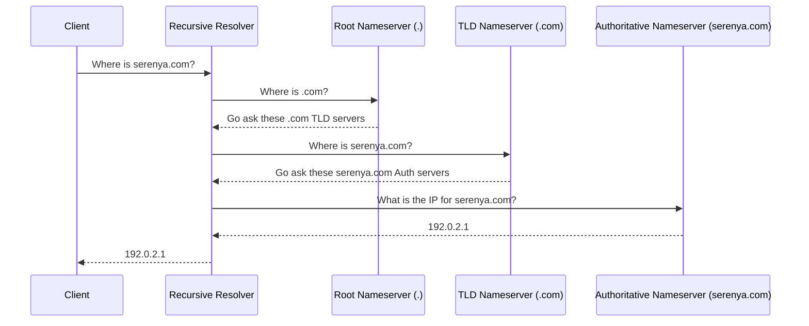

# System Design Basics: How DNS Resolution Actually Works

## The Problem
Humans read domain names (`serenya.com`); networking hardware routes via IP addresses (`192.0.2.1`). We need a globally distributed, highly available mapping system that can resolve billions of queries per second without introducing massive latency or single points of failure. The Domain Name System (DNS) is this infrastructure. 

## The Mental Model
Think of DNS not as a single global phonebook, but as a hierarchical delegation of phonebooks. If you want a phone number for someone in a specific city, you don't ask a global directory. You ask a global directory for the country's directory, ask the country for the state, the state for the city, and finally the city for the person. This hierarchy prevents any single server from bottlenecking the internet.

## The Resolution Path
When a user types `serenya.com` into their browser, the resolution process traverses multiple caching layers before hitting the internet. 

1. **Browser Cache:** The browser checks its internal DNS cache.
2. **OS Cache:** The operating system checks its resolver cache.
3. **Recursive Resolver:** The query hits the ISP or a public resolver (like Google's `8.8.8.8` or Cloudflare's `1.1.1.1`). 

If the recursive resolver doesn't have the answer cached, it begins the iterative lookup process:

1. **Root Nameserver (`.`):** Knows where the Top Level Domain (TLD) servers are.
2. **TLD Nameserver (`.com`):** Knows where the Authoritative servers for the specific domain are.
3. **Authoritative Nameserver:** Holds the actual DNS records for the domain.

## Core DNS Records
DNS holds various types of records, the most crucial being:

- **A Record (Address):** Maps a hostname to an IPv4 address.
- **AAAA Record:** Maps a hostname to an IPv6 address.
- **CNAME (Canonical Name):** Maps a hostname to another hostname (an alias). Useful when multiple services point to the same underlying infrastructure, but introduces an extra DNS lookup penalty.
- **ALIAS / ANAME:** Non-standard records provided by modern DNS providers (like Route53) that act like CNAMEs but resolve at the root of a domain (apex) without the performance penalty of a second lookup.

## Advanced: Scaling with Anycast
Public resolvers like `8.8.8.8` receive astronomical traffic. If `8.8.8.8` was a single server in California, a user in Tokyo would experience high latency. DNS solves this using **Anycast routing**.

In Anycast, multiple physical servers across the globe broadcast the same IP address (`8.8.8.8`) via BGP (Border Gateway Protocol). When a user in Tokyo queries `8.8.8.8`, the internet's routing infrastructure inherently delivers the packet to the topologically closest server (the Tokyo node). This provides massive horizontal scalability and built-in DDoS mitigation; if one node is attacked, the localized attack traffic is absorbed by the nearest PoP (Point of Presence) rather than taking down a central server.

## Architectural Takeaway
When designing systems, DNS is your first layer of load balancing. Using short TTLs (Time to Live) on records allows for relatively rapid failover, while DNS routing policies (Weighted, Latency-Based, Geolocation) allow you to steer users to the optimal datacenter before they even establish a TCP connection. However, DNS caching by ISPs and browsers means you cannot rely on DNS alone for instantaneous sub-second failover.