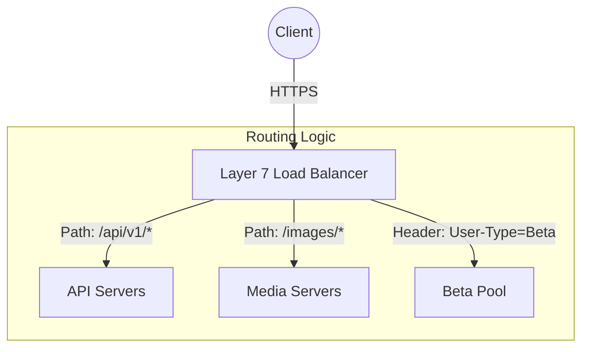

# System Design Basics: Layer 4 vs Layer 7 Load Balancing

## The Problem
A single server has finite resources (CPU, Memory, Network I/O). As traffic scales, we must distribute incoming requests across a fleet of servers. A Load Balancer sits between the clients and the backend servers, but the complexity of the balancing decision depends heavily on which OSI model layer the load balancer operates: Layer 4 (Transport) or Layer 7 (Application).

## The Mental Model
- **Layer 4 (L4) is a Shipping Clerk:** The clerk looks only at the outside of the envelope (IP addresses and port numbers). They do not open the envelope. They blindly and quickly forward the package to the designated department.
- **Layer 7 (L7) is a Receptionist:** The receptionist opens the envelope, reads the contents of the letter, and routes it based on the actual request (e.g., "Oh, this is an image request, send it to the Media department. This is a billing API, send it to Finance.").

## Layer 4 Load Balancing (Transport Layer)
At Layer 4, the load balancer routes traffic based on network and transport layer protocols (IP, TCP, UDP).

### How it works
The load balancer receives a TCP connection, inspects the source/destination IP and port, and forwards the packets to a backend server using Network Address Translation (NAT) or Direct Server Return (DSR). It does not inspect the HTTP payload.

### Advantages
- **Blazing Fast & Low Resource:** Since it only looks at packet headers, it requires minimal compute.
- **Protocol Agnostic:** Can balance anything running on TCP or UDP (Databases, Redis, custom binary protocols).
- **Simplicity:** No SSL termination required at the LB; end-to-end encryption can occur straight to the backend.

### Disadvantages
- **Blind Routing:** It cannot route based on URL paths, cookies, or HTTP headers.
- **Uneven Load:** If a single client sends a massive HTTP stream over a single TCP connection, one backend server takes the full hit.

## Layer 7 Load Balancing (Application Layer)
At Layer 7, the load balancer parses the application-level data (HTTP/HTTPS, HTTP/2, gRPC). 

### How it works
The L7 load balancer must fully terminate the TCP connection, decrypt the SSL/TLS payload, read the HTTP request (headers, path, cookies), make a routing decision, and then open a *new* TCP connection to the chosen backend server.

### Advantages
- **Smart Routing:** Microservices architecture heavily relies on L7. You can route `/api/users` to the User Service and `/api/orders` to the Order Service.
- **Traffic Shaping:** Rate limiting per user, A/B testing via headers, and caching can all be performed at the edge.
- **SSL Offloading:** Terminating SSL at the load balancer frees up backend CPU resources.

### Disadvantages
- **Compute Heavy:** Terminating SSL and parsing HTTP headers requires significantly more CPU and memory.
- **Latency Penalty:** Terminating and establishing two separate TCP connections adds a slight latency overhead.

## Architectural Takeaway
Modern system design usually employs both. A massive global service will use **L4 load balancers** (often via Anycast and ECMP) at the edge to distribute raw TCP traffic across data centers with extremely high throughput. Within the datacenter, those L4 load balancers pass traffic to **L7 load balancers** (like Nginx, Envoy, or HAProxy), which intelligently route the HTTP requests to the specific microservices that handle the business logic.