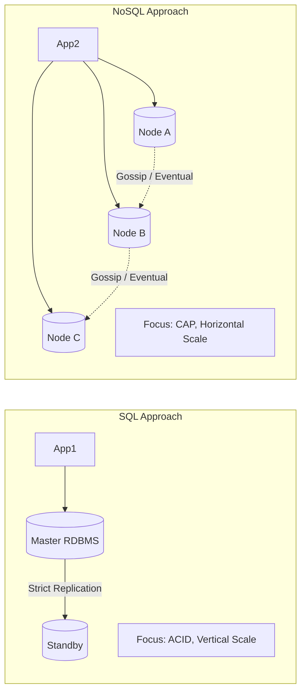

# System Design Basics: SQL vs NoSQL

## The Problem
State must be stored. For decades, the Relational Database Management System (RDBMS/SQL) was the default choice. However, as the internet scaled and unstructured data exploded, relational databases hit horizontal scaling limits. The industry responded with NoSQL databases, trading strict guarantees for distributed scalability. Choosing between them is the most foundational decision in system design.

## The Mental Model
- **SQL (Relational):** A strict, hyper-organized accounting ledger. Every row has a rigid structure (schema). Changing the structure requires a formal process (migration). It guarantees that the ledger is never mathematically incorrect.
- **NoSQL (Non-Relational):** A flexible filing cabinet. You can throw JSON documents, key-value pairs, or graphs into it without defining the structure upfront. It scales infinitely by simply buying more filing cabinets, but it might take a moment for a document placed in cabinet A to be replicated to cabinet B.

## SQL and ACID Guarantees
Relational databases (PostgreSQL, MySQL) store data in tables linked by foreign keys (normalization). They are designed to enforce **ACID** properties:

- **Atomicity:** A transaction (e.g., deducting $10 from Alice, adding $10 to Bob) happens entirely, or not at all.
- **Consistency:** The database strictly enforces rules (constraints, triggers). 
- **Isolation:** Concurrent transactions don't interfere with each other.
- **Durability:** Once committed, data survives power loss.

### The Scaling Challenge
SQL databases scale vertically (buying a bigger, more expensive machine). Horizontal scaling (sharding across multiple machines) is notoriously difficult because enforcing ACID constraints across network boundaries (Distributed Transactions) introduces massive latency and complexity.

## NoSQL and The CAP Theorem
NoSQL databases (MongoDB, DynamoDB, Cassandra) abandoned the strict relational model. By removing complex joins and ACID guarantees across multiple documents, they made data highly partitionable. 

This design is governed by the **CAP Theorem**, which states a distributed system can only provide two out of three guarantees:
1. **Consistency:** Every read receives the most recent write.
2. **Availability:** Every request receives a non-error response.
3. **Partition Tolerance:** The system operates despite network drops between nodes.

Because network partitions (P) are unavoidable in distributed systems, architects must choose between **CP** (Consistency) or **AP** (Availability).

### Eventual Consistency
Many NoSQL databases opt for Availability (AP). If a node goes down, the system still accepts writes. The trade-off is **Eventual Consistency**: if you write a value to Node A, and immediately read from Node B, you might get stale data. Given enough time without new writes, all nodes will eventually converge on the same state.

## When to Choose Which?

**Choose SQL when:**
- You are handling financial transactions, inventory, or billing.
- Your data relationships are highly complex (heavy JOIN requirements).
- Data integrity and strict schemas are non-negotiable.
- (Note: Modern NewSQL like CockroachDB/Spanner offer horizontal scaling with ACID).

**Choose NoSQL when:**
- You require rapid, flexible development without strict schema migrations.
- You are handling massive volumes of unstructured or semi-structured data (logs, social feeds, IoT telemetry).
- You need extreme write throughput and can tolerate eventual consistency.
- You are building a pure Key-Value cache (Redis) or Document store (MongoDB).