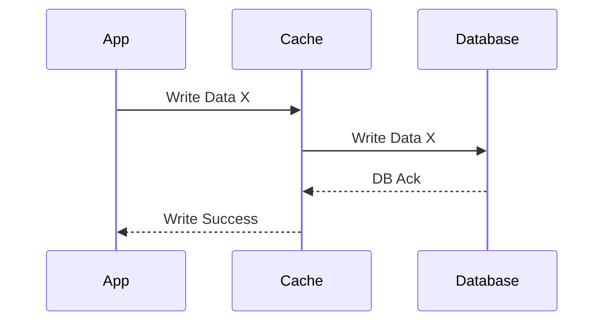

# System Design Basics: Caching Strategies

## The Problem
Databases are fundamentally constrained by disk I/O. As read traffic scales, continuously querying the database for the same data causes latency spikes and eventual system failure. We solve this by introducing an in-memory Cache (like Redis or Memcached), which is orders of magnitude faster than a disk-based database. But how exactly should the application interact with the cache and the database to keep data consistent?

## The Mental Model
Imagine a library. The database is the deep archives in the basement (slow, huge capacity). The cache is the librarian's front desk (extremely fast, very limited space). How does the librarian decide what books belong on the desk?

## Strategy 1: Cache Aside (Lazy Loading)
In this pattern, the application is responsible for orchestrating the dance between the cache and the database. The cache does not interact directly with the database.

**The Flow:**
1. App asks the Cache for data.
2. If found (**Cache Hit**), return to user.
3. If not found (**Cache Miss**), App asks the Database.
4. App returns data to user AND writes the data into the Cache for the next request.

**Pros:** The cache only contains data that is actually requested (efficient memory use). A cache failure doesn't break the system; the app just falls back to the database.
**Cons:** The initial request (the miss) suffers a latency penalty (three network hops). Data can become stale if the database is updated by another process.

## Strategy 2: Read-Through and Write-Through
In this pattern, the application treats the cache as the main data store. The cache provider itself is responsible for reading from and writing to the underlying database.

**Write-Through Flow:**
1. App writes data to the Cache.
2. Cache synchronously writes data to the Database.
3. Once both are complete, return success to App.

**Pros:** Code is simplified. Data in the cache is never stale. 
**Cons:** Every write suffers the latency of writing to *both* systems synchronously. If a lot of data is written but rarely read, it wastes cache memory.

## Strategy 3: Write-Behind (Write-Back)
This is built for extreme performance. Like Write-Through, the application only talks to the cache. However, the cache updates the database *asynchronously*.

**Write-Behind Flow:**
1. App writes data to the Cache.
2. Cache immediately returns success to the App.
3. A background process batches the updates and writes them to the Database later.

**Pros:** Blazing fast write performance. Perfect for write-heavy workloads (like counting YouTube views or gaming leaderboards) because DB writes are batched.
**Cons:** **Data Loss Risk.** If the cache node crashes before the background process flushes to the database, the data is permanently lost.

## Architectural Takeaway
- Use **Cache Aside** for read-heavy apps where slight staleness is acceptable (User Profiles).
- Use **Write-Through** when you need strict consistency between cache and DB (Banking settings).
- Use **Write-Behind** when write volume would crush your database and you can tolerate edge-case data loss (Analytics counters).