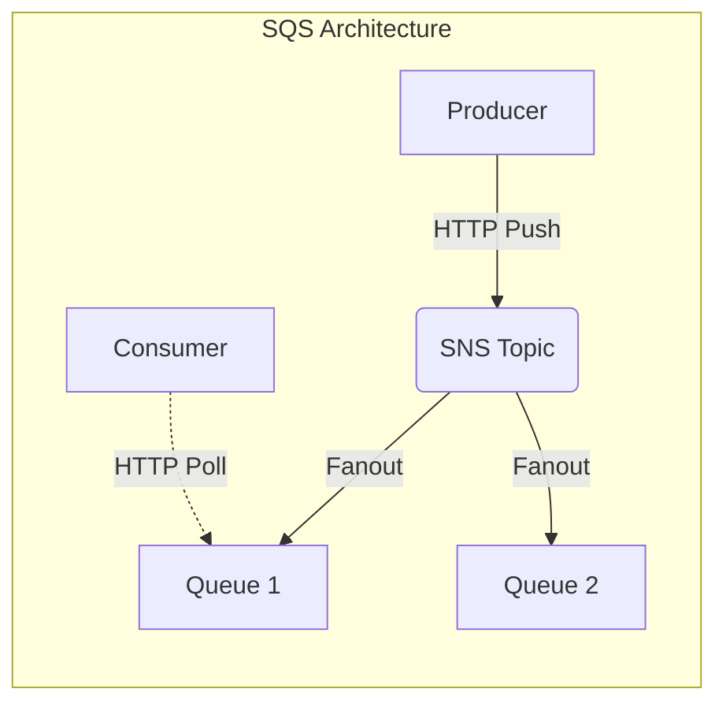

# System Design Basics: Asynchronous Processing with Message Queues

## The Problem
In a synchronous architecture, when Service A calls Service B, Service A must wait for a response. If Service B is doing heavy image processing, Service A is blocked. If Service B crashes, Service A fails. If traffic spikes 100x, Service B is overwhelmed and the whole system cascades into failure. We need a way to decouple these services, allowing them to operate at their own pace.

## The Mental Model
Imagine a restaurant. 
- **Synchronous:** The waiter takes your order, walks to the kitchen, and stares at the chef until the food is cooked. The waiter can serve no one else.
- **Asynchronous (Message Queue):** The waiter writes the order on a ticket, places it on a rotating ticket wheel (the Queue), and goes back to taking more orders. The chef pulls tickets from the wheel at their own pace. 

## Core Concepts
A Message Queue acts as an intermediary buffer.
1. **Producer:** The service that creates the message and sends it to the queue (e.g., the web server taking a user upload).
2. **Queue:** The buffer that stores the messages in order.
3. **Consumer:** The backend worker that pulls messages from the queue and processes them.

### Benefits of Queues
- **Decoupling:** Producers and consumers don't need to know about each other.
- **Backpressure / Load Leveling:** If a massive spike of traffic hits, the queue simply grows larger. The consumers continue processing at a safe, steady rate without crashing.
- **Retries and Dead Letter Queues (DLQ):** If a consumer fails to process a message, the queue can automatically retry it. If it fails 5 times, it gets moved to a DLQ for human inspection.

## RabbitMQ vs SQS: Two Different Philosophies

While both are message brokers, they approach the problem differently.

### RabbitMQ: Smart Broker, Dumb Consumer
RabbitMQ (using the AMQP protocol) has a complex routing engine inside the broker. Producers send messages to an **Exchange**, which uses routing keys to push the message into various queues. 

- **Push Model:** RabbitMQ actively pushes messages to consumers via long-lived TCP connections.
- **Complex Routing:** You can do fanout (Pub/Sub), topic-based routing, and direct routing natively.
- **Trade-off:** Because the broker tracks which messages are acknowledged by which consumers, scaling RabbitMQ itself can become complex under massive load.

### Amazon SQS: Dumb Broker, Smart Consumer
SQS is a fully managed AWS service designed for near-infinite scale. It is a simple, highly durable pipe.

- **Pull Model:** Consumers actively poll SQS over HTTP to ask, "Do you have any messages?"
- **Simple Routing:** It is strictly point-to-point. (If you want Pub/Sub routing in AWS, you must put an SNS Topic in front of SQS).
- **Trade-off:** The developer has to write the polling logic (or use AWS Lambda event sources). It lacks the advanced routing of RabbitMQ, but you never have to worry about the broker crashing.

## Architectural Takeaway
Introduce Message Queues whenever a task does not need to be completed instantly for the user. Sending emails, generating PDFs, calculating analytics, and integrating with slow third-party APIs should all be pushed to a queue. Use SQS for massive scale and operational simplicity; use RabbitMQ if you need complex, on-premise routing topologies.