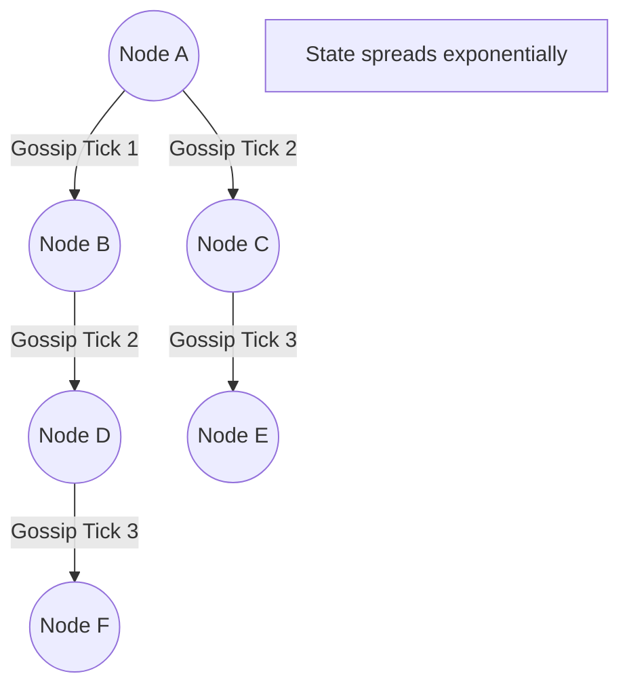

# Advanced System Design: Epidemic Gossip Protocols

## The Problem
In a centralized system, a single master node keeps track of the health and state of all worker nodes. But in massive, decentralized peer-to-peer systems (like DynamoDB, Cassandra, or Consul clusters with 1,000+ nodes), a centralized coordinator becomes a massive bottleneck and a single point of failure. How can thousands of nodes agree on the cluster's topology (who is alive, who is dead, and where data lives) without a master orchestrator?

## The Mental Model
Think of a real-world office rumor (gossip). If one person learns a secret, they don't call a company-wide meeting to announce it (centralized broadcast). Instead, they tell two random coworkers. In the next hour, those two people each tell two more random coworkers. Even in a massive corporation, the rumor spreads to the entire building exponentially fast. Gossip Protocols (also known as Epidemic Protocols) use this exact mathematical reality.

## The Mechanics of Gossip

A Gossip Protocol operates on randomized, periodic peer-to-peer communication.

1. **The Tick:** Every second (or configured interval), Node A randomly selects another node in the cluster, say Node D.
2. **The Exchange:** Node A and Node D exchange their current view of the cluster state. This is often done by exchanging a version vector or a list of node heartbeats.
3. **The Merge:** If Node A learns that Node C recently joined the cluster (a fact Node D knew, but Node A didn't), Node A updates its internal state. Similarly, Node D updates its state based on what Node A knew.
4. **The Infection:** In the next second, Node A will pick a new random node (Node F) and spread the updated state.

Because the communication is exponential, a new piece of information propagates through a cluster of $N$ nodes in $O(\log N)$ time.

## Failure Detection (Phi Accrual)
Gossip isn't just for sharing config; it's primarily used for Failure Detection. 
Instead of a simple "Alive or Dead" binary, modern gossip protocols use something like the **Phi Accrual Failure Detector**.

As nodes gossip, they share the timestamps of the last time they heard from every other node. If Node A hasn't heard a rumor about Node Z in 10 seconds, the *probability* (Phi) that Node Z is dead increases. Once Phi crosses a configurable threshold, the cluster agrees Node Z is dead and routes traffic away from it. This probabilisitic approach gracefully handles transient network latency without falsely marking healthy nodes as dead.

## Trade-offs and Considerations

**Advantages:**
- **Extreme Scalability:** There is no master node to overload. The network overhead per node remains constant regardless of the cluster size.
- **Robustness:** Highly resilient to network partitions and node failures. If half the network drops, the two halves will happily continue gossiping among themselves.

**Disadvantages:**
- **Eventual Consistency:** State changes are not instantaneous. If a node dies, it takes a few seconds for the entire cluster to realize it, meaning some traffic might be routed into a black hole temporarily.
- **Bandwidth:** Constant background chatter consumes a baseline level of network bandwidth, though modern implementations heavily compress the exchanged state.

## Architectural Takeaway
Use Gossip Protocols when building highly available, masterless distributed systems where eventual consistency of cluster metadata is acceptable. It is the engine that allows Cassandra, Riak, and Amazon Dynamo to scale linearly without coordination bottlenecks.