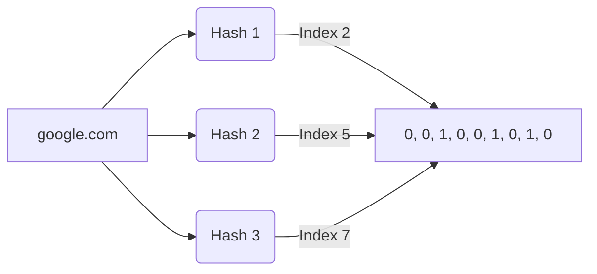

# Advanced System Design: Probabilistic Data Structures

## The Problem
At a certain scale, deterministic data structures (HashMaps, Trees, Sets) run out of memory. 
Imagine you are building a web crawler, and you need to keep track of 10 billion URLs you've already visited so you don't crawl them again. Storing 10 billion URLs in a standard Hash Set would require hundreds of gigabytes of RAM. If you check the database on disk every time, your crawler will be disastrously slow. How do we solve memory constraints when exact precision isn't strictly necessary?

## The Mental Model
Think of a bouncer at a massive club. Memorizing the face of every single person who has ever been banned (deterministic) is impossible. Instead, the bouncer uses a quick rule-of-thumb checklist (probabilistic). If you hit a red flag, he says "You *might* be banned, let me check the slow main computer." If you hit zero flags, he says "You are *definitely not* banned, go right in." 

Probabilistic data structures trade absolute precision for massive memory compression, usually guaranteeing that they will never give a **False Negative**, even if they occasionally give a **False Positive**.

## The Bloom Filter
A Bloom Filter is used to answer one question: **"Is this item in the set?"**

### How it works
It consists of a large array of bits (all initially set to 0) and a few different hash functions.
1. **Adding an item:** When you add "google.com", you run it through 3 different hash functions. They output 3 array indices (e.g., 4, 12, 88). You flip those bits in the array to 1.
2. **Checking an item:** To check if "yahoo.com" has been visited, you run it through the same 3 hash functions. Suppose it outputs (4, 15, 88). You check the array. Bits 4 and 88 are 1, but Bit 15 is 0. 

Because at least one bit is 0, you know with **100% certainty** that "yahoo.com" has never been added. 
If all three bits were 1, it *probably* was added, but it might be a collision from other URLs. 

**Trade-off:** You can never remove an item from a standard Bloom Filter, because setting a bit back to 0 might accidentally remove data from a different, overlapping item.

## Count-Min Sketch
While Bloom Filters track *existence*, a Count-Min Sketch tracks *frequency*.
Imagine calculating the top 100 trending hashtags on Twitter in real-time. Storing a counter for millions of unique hashtags takes too much memory.

A Count-Min Sketch uses a 2D matrix of counters and multiple hash functions. When `#sysdesign` occurs, it is hashed by 3 functions, resulting in 3 indices across 3 rows. The counters at those indices are incremented. 
To query the frequency of `#sysdesign`, you hash it, look at the 3 corresponding counters, and take the **minimum** value of the three. Like Bloom Filters, it overestimates (due to collisions) but never underestimates.

## Architectural Takeaway
Whenever a System Design interview involves extreme scale ("billions of events," "preventing expensive DB lookups," "real-time heavy hitters"), reach for probabilistic structures. 
- Use **Bloom Filters** in front of a database or cache to instantly bypass queries for non-existent data (avoiding cache penetration).
- Use **Count-Min Sketches** for real-time analytics, rate-limiting, and trending topics where a slight margin of error is acceptable for an massive reduction in RAM.