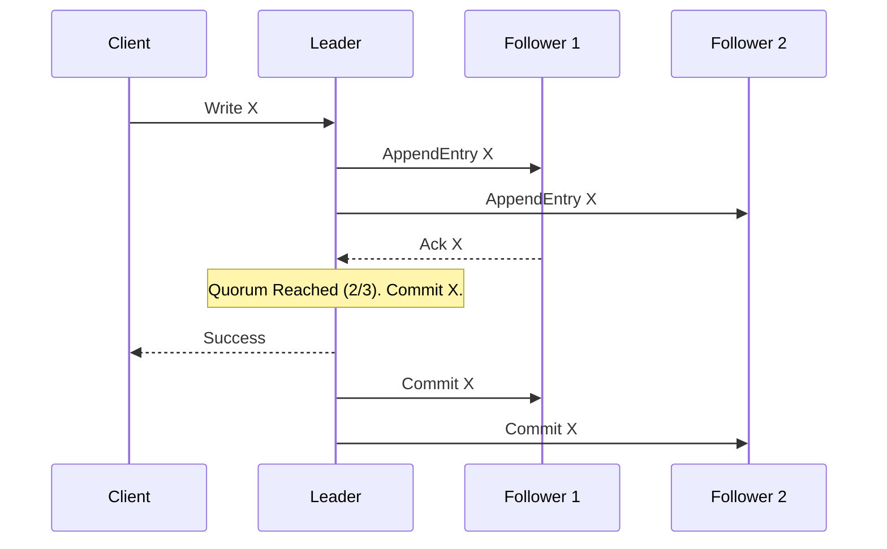

# Advanced System Design: Distributed Consensus (Raft vs Paxos)

## The Problem
When building a distributed, highly available database, you replicate data across multiple nodes so that if one dies, the data survives. But what happens if two users try to update the exact same record at the exact same time on two different nodes? If the nodes don't agree on the order of operations, the data diverges, and the system fails. 

How do independent machines communicating over an unreliable network agree on a single source of truth? This is the **Consensus Problem**.

## The Mental Model
Imagine a board of five directors trying to agree on a company decision. They are in different rooms, communicating only by sliding notes under doors (network packets). Sometimes notes get lost, sometimes a director falls asleep (node crash). If three of them (a majority/quorum) can agree on a sequence of events, the decision becomes official, even if the other two are asleep.

## Paxos: The Pioneer
In the 1990s, Leslie Lamport published Paxos, a mathematically proven algorithm to solve distributed consensus. 
- **The Good:** It is highly robust and operates perfectly even if nodes crash and recover. It allows any node to propose a change at any time.
- **The Bad:** It is famously incomprehensible. The original paper was written as an analogy about a fictional Greek parliament, baffling engineers for a decade. Implementing Paxos in the real world is incredibly complex, leading to subtle bugs because developers simply could not reason about its edge cases.

## Raft: Designed for Understandability
In 2013, researchers created **Raft**, an algorithm designed explicitly to be understandable while providing the exact same safety guarantees as Paxos. It achieves this by aggressively dividing the consensus problem into three distinct pieces: Leader Election, Log Replication, and Safety.

### 1. Leader Election
Unlike Paxos where anyone can lead, Raft enforces a strict dictatorship.
- Nodes start as **Followers**.
- If a Follower doesn't hear a heartbeat from a Leader within a randomized timeout (e.g., 150ms-300ms), it promotes itself to **Candidate** and asks for votes.
- The first Candidate to get a majority of votes (a Quorum) becomes the **Leader**. The randomized timers ensure two nodes rarely call an election at the exact same millisecond.

### 2. Log Replication
All data changes *must* go through the Leader.
1. Client asks to write `x = 5`.
2. Leader appends this to its own log (uncommitted).
3. Leader sends the log entry to all Followers.
4. Once a majority of Followers acknowledge they wrote it, the Leader **commits** the entry and applies it to its state machine.
5. Leader tells the client "Success" and tells the Followers they can commit it too.

### 3. Safety (Quorum)
The core of Raft (and Paxos) is the **Quorum**: $N/2 + 1$. 
In a 5-node cluster, a quorum is 3. This means 2 nodes can completely explode, and the system continues. Furthermore, because a Leader must have the most up-to-date log to win an election, committed data can never be accidentally overwritten by an older node waking up.

## Architectural Takeaway
Whenever you see a system that manages cluster metadata or strict coordination (etcd, Consul, Apache Kafka, Kubernetes), there is a consensus algorithm at its core. Today, **Raft is the industry standard** for new systems due to its ease of implementation, while Paxos remains deeply embedded in older, foundational tech like Google Spanner.