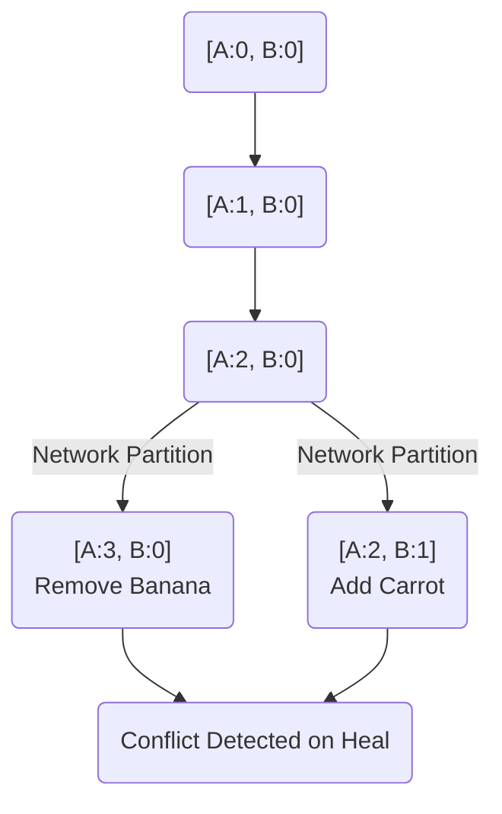

# Advanced System Design: Resolving Partitions with Vector Clocks

## The Problem
In active-active distributed databases (like Amazon DynamoDB or Riak), a system favors Availability over strict Consistency (AP in the CAP theorem). If a network partition occurs, Node A and Node B might both accept a write for the same user's shopping cart. 

When the network heals, the database realizes there are two different versions of the shopping cart. How does it know which one is newer? We cannot use standard time (e.g., NTP UNIX timestamps) because physical clocks drift; a server with a clock running 50 milliseconds fast could overwrite valid, newer data.

## The Mental Model
Imagine co-authoring a script with a colleague. Instead of writing timestamps on the draft (which are useless if one of you forgot to adjust for daylight saving time), you track versions based on causality. 
You write: "Draft 2: I read Alice's Draft 1." 
Alice writes: "Draft 3: I read Bob's Draft 2."
Because Alice explicitly states she saw your changes, her version is definitively newer. This tracking of *what happened before what* is called Logical Time.

## Enter Vector Clocks
A Vector Clock is an array of counters, where each node in a cluster gets its own counter. 
For a 3-node cluster (Nodes A, B, C), the initial state of a record is `[A:0, B:0, C:0]`.

### How they tick
Every time a node writes to the record, it increments its own counter in the vector.

1. **Write 1 (Node A):** Client adds an Apple. Node A processes it. Vector: `[A:1, B:0, C:0]`.
2. **Write 2 (Node A):** Client adds a Banana. Node A processes it. Vector: `[A:2, B:0, C:0]`.
3. **Replication:** Node A replicates this cart to Node B. Node B now has `[A:2, B:0, C:0]`.

### Detecting Conflicts
Now a network partition happens. Node A and Node B cannot talk.
- Client X talks to **Node A** and removes the Banana. Node A increments: `[A:3, B:0, C:0]`.
- Client Y (on a different device) talks to **Node B** and adds a Carrot. Node B increments: `[A:2, B:1, C:0]`.

When the network heals, the database compares the two vectors.
- Version X: `[A:3, B:0, C:0]`
- Version Y: `[A:2, B:1, C:0]`

**The Rule:** A vector is strictly newer than another *only* if every single counter is greater than or equal to the other. 
In our case, Version X has a higher A counter, but Version Y has a higher B counter. The database mathematically determines that neither version is strictly newer. They are **concurrent**—a conflict has occurred.

## Resolution: Sibling Records
Because the database cannot safely choose without losing data, it stores *both* versions as **Siblings**. 
The next time a client requests the shopping cart, the database returns both arrays. It is then the application's responsibility to merge them (e.g., combining the items to include the Apple, the Carrot, and acknowledging the removal of the Banana) and write back a new, unified state with a new vector clock.

## Architectural Takeaway
Vector Clocks allow distributed systems to safely achieve eventual consistency without relying on physical time. Use them (or their modern successors like Dotted Version Vectors) when designing systems where High Availability (always accepting writes) is critical, but accidental data loss (overwriting concurrent updates) is unacceptable.