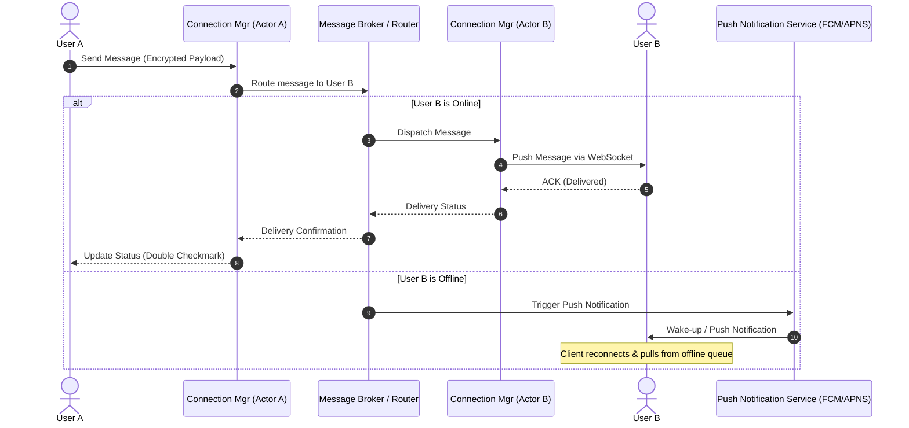

# Designing WhatsApp: WebSockets, XMPP, and Actor-Based Scalability

## The Problem: The Stateless HTTP Fallacy at Billion-User Scale

When building a chat application, the naive architectural approach is to rely on standard stateless HTTP patterns. Developers attempt to achieve real-time messaging by having client devices poll a REST endpoint every few seconds:

```
+------------+               +---------------+               +------------+
|  Client A  | -- HTTP GET ->|  Web Server   | -- DB Query ->|  Database  |
|            | <- HTTP 200 --| (No New Msg)  |               |            |
+------------+               +---------------+               +------------+
```

This stateless polling pattern completely breaks down under three major bottlenecks when scaling to millions—let alone billions—of active users:

1. **Massive Network Overhead:** Standard HTTP/1.1 or even HTTP/2 requests carry substantial header overhead (often 500 bytes to 2KB per request). Multiplying this by billions of polls per minute translates to gigabytes of useless network traffic, congesting cellular networks and inflating cloud infrastructure costs.
2. **Database Exhaustion:** Continuous polling floods read-replicas or caches with "no-op" queries to check for new messages, draining CPU cycles and memory.
3. **High Latency & Poor UX:** Polling introduces a structural lag. If a client polls every 5 seconds, a message sent immediately after a poll will wait up to 5 seconds to be delivered, ruining the real-time experience.

Even long-polling (Server-Sent Events) or basic HTTP keep-alive solutions fail to scale horizontally because conventional multi-threaded web servers (e.g., Apache, JVM-based Tomcat) allocate a heavy OS thread (typically 1MB to 2MB stack size) per connection. Storing 10 million idle connections on such servers would require 10 to 20 Terabytes of RAM just for thread overhead.

---

## The Mental Model: Persistent Switchboard & Actor-Based Isolation

To scale a real-time system to billions of users, we must shift our mental model from **pull-based stateless transactions** to a **push-based persistent switchboard**.

Instead of clients continuously knocking on the door, they establish a single, long-lived bidirectional connection to a specialized gateway. This gateway holds the connection open, keeping memory footprint to an absolute minimum, and pushes messages down the pipe the millisecond they arrive.

```
+------------+             +--------------------+             +------------+
|  Client A  | -- Msg ---> | Connection Manager | -- Broker ->|  Client B  |
| (WebSocket)|             | (Erlang Actor A)   |             |(WebSocket) |
+------------+             +--------------------+             +------------+
```

To implement this model, we decouple connection management from core application logic using three architectural pillars:

### 1. WebSockets vs. XMPP (eXtensible Messaging and Presence Protocol)
While WebSockets provide a low-overhead, bidirectional transport layer over a single TCP connection, XMPP defines the structured application protocol on top of it. XMPP represents messages, presence (online/offline), and contact lists (rosters) as semantic XML snippets. By customizing XMPP to use a binary format or protocol buffers, WhatsApp stripped out XML's wordy boilerplate, keeping the data packet payload miniscule.

### 2. The Erlang Lightweight Actor Model
Erlang (and Elixir) utilizes the Actor Model inside the BEAM Virtual Machine. Instead of OS threads, BEAM uses lightweight, user-space processes (actors) that consume only ~2.6 KB of memory per process. 
- Every connected user is represented by a single **Connection Actor**.
- Actors communicate purely via asynchronous message-passing.
- There is no shared memory; each actor has its own isolated garbage-collected heap.
This means a single server with 64GB of RAM can easily maintain over 2 million active WebSocket connection actors.

---

## The Architecture: End-to-End Flow

Here is how a message travels from User A to User B, featuring routing, broker fallback, and push notifications for offline clients:



---

## Conceptual Implementation: Elixir Connection Registry & Router

The following conceptual Elixir code illustrates how a connection actor registers itself, processes incoming client socket messages, and routes them to peer actors.

```elixir
defmodule WhatsApp.ConnectionHandler do
  use GenServer
  require Logger

  # Client API
  def start_link(client_id, socket) do
    GenServer.start_link(__MODULE__, {client_id, socket})
  end

  # Server Callbacks
  @impl true
  def init({client_id, socket}) do
    # Register the actor in a global partition registry for routing lookups
    Registry.register(WhatsApp.ConnectionRegistry, client_id, self())
    Logger.info("User #{client_id} connected. Actor started: #{inspect(self())}")
    {:ok, %{client_id: client_id, socket: socket}}
  end

  @impl true
  def handle_info({:incoming_message, recipient_id, encrypted_payload}, state) do
    # Route to the recipient process via the Registry
    case Registry.lookup(WhatsApp.ConnectionRegistry, recipient_id) do
      [{recipient_pid, _value}] ->
        # Recipient is online on this node, send message to their actor
        send(recipient_pid, {:deliver_message, state.client_id, encrypted_payload})
        {:noreply, state}

      [] ->
        # Recipient is offline or on another node; delegate to message broker
        WhatsApp.MessageBroker.publish(recipient_id, state.client_id, encrypted_payload)
        {:noreply, state}
    end
  end

  @impl true
  def handle_info({:deliver_message, sender_id, encrypted_payload}, state) do
    # Push the payload directly down the client's TCP/WebSocket connection
    send_to_socket(state.socket, %{sender_id: sender_id, data: encrypted_payload})
    # Send delivery confirmation back to sender
    WhatsApp.Router.confirm_delivery(sender_id, state.client_id)
    {:noreply, state}
  end

  defp send_to_socket(_socket, _payload) do
    # Native port driver send call (low overhead TCP push)
    :ok
  end
end
```

---

## Actionable Takeaways

1. **Kill Polling Early:** For any high-frequency real-time feature, reject HTTP polling. Adopt WebSockets or gRPC bidirectional streams to eliminate header overhead and deliver sub-millisecond latency.
2. **Invest in Actor-Like Isolation:** When handling massive concurrency, traditional thread-per-connection models fail. Adopt Erlang/Elixir, or actor frameworks in JVM/Go (e.g., Akka/Protoactor), to model connection lifecycles within lightweight processes.
3. **Decouple Connections from Core Logic:** Never run heavy analytical queries or disk-intensive operations inside connection managers. Let connection managers act strictly as thin, fast relays that offload heavy computations to message queues (RabbitMQ, Kafka) or event brokers.
