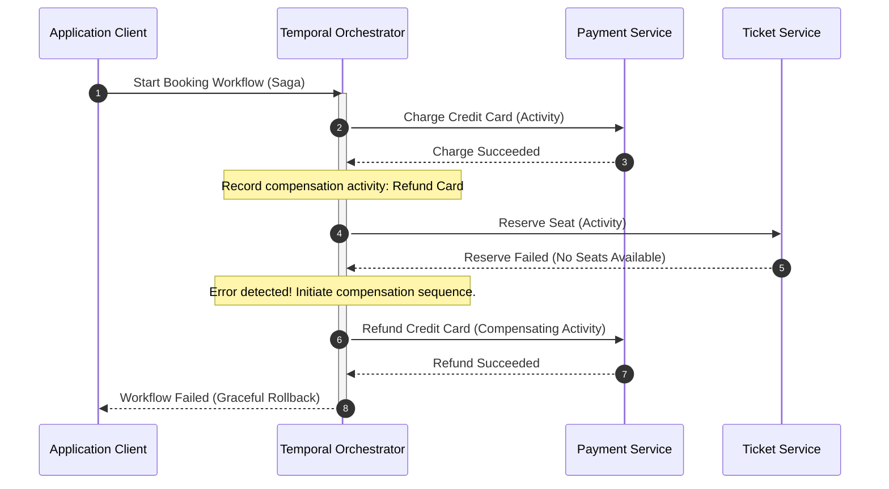

# Saga Pattern: Centralized Orchestration with Temporal

## The Problem: The Distributed Transaction Disaster

In a traditional monolithic system, ensuring that a series of operations either all succeed or all fail is trivial. You wrap the database calls inside a standard ACID transaction, and the database guarantees atomicity:

```sql
BEGIN TRANSACTION;
  UPDATE accounts SET balance = balance - 100 WHERE id = 1;
  INSERT INTO ticket_reservations (user_id, ticket_id) VALUES (1, 42);
COMMIT; -- If reservation fails, the balance update is rolled back automatically
```

However, once you decompose this monolith into microservices—such as a **Payment Service**, a **Ticket Service**, and a **Notification Service**—you can no longer use database-level ACID transactions. Each microservice maintains its own encapsulated database.

If you attempt a multi-step operation like booking a trip:
1. **Payment Service** charges the customer's credit card.
2. **Ticket Service** tries to reserve the ticket, but finds that the last seat was sold seconds ago and fails.

At this point, the customer has been charged, but they have no ticket. Since there is no global database lock, the system is left in an inconsistent, corrupted state. Standard distributed lock protocols like Two-Phase Commit (2PC) introduce high latency, are highly vulnerable to network partitions, and create tight coupling across your microservices, violating the core philosophy of a distributed architecture.

---

## The Mental Model: Centralized Orchestration vs. Event-Driven Chaos

The **Saga Pattern** solves this problem by breaking a single distributed transaction into a sequence of local transactions. Each local transaction updates the database of a single service. If a step in the sequence fails, the Saga runs a series of **compensating transactions** in reverse order to roll back the changes and restore consistency.

```
       Happy Path: [Step 1: Charge] ---> [Step 2: Reserve] ---> [Step 3: Notify]
                                                                        | (Fails)
                                                                        v
   Compensating:   [Rollback Charge] <--- [Release Reservation] <-------+
```

There are two primary ways to coordinate a Saga:
1. **Choreography (Decentralized):** Services emit and listen to events without a central coordinator. This quickly degenerates into an unmaintainable "spaghetti" flow where tracing the exact state of a transaction is nearly impossible.
2. **Orchestration (Centralized):** A dedicated coordinator service directs the workflow, telling each service what to do and managing rollbacks if anything fails.

### The Modern Way: Centralized Orchestration with Temporal
Instead of writing a custom orchestrator with complex database polling, state tracking, and retry logic, developers use **Temporal**. 

Temporal is a developer-first platform that lets you write highly reliable, distributed workflows as standard code (Go, TypeScript, Java, Python). Temporal handles the state-machine orchestration, failure detection, timeouts, and retries out of the box, ensuring that your workflow runs to completion even if your servers crash or restart mid-execution.

---

## The Architecture: Saga Coordination Flow

Here is how Temporal acts as a centralized orchestrator to coordinate a booking workflow, handling a downstream failure by executing compensating activities in reverse order:



---

## Code Example: Go Temporal Workflow with Compensation Queue

The following Go implementation demonstrates how to define a resilient Saga workflow in Temporal, registering compensations dynamically and executing them in reverse order if an error is encountered.

```go
package booking

import (
	"context"
	"time"

	"go.temporal.io/sdk/workflow"
)

// BookingSagaWorkflow orchestrates payment and ticket reservations with compensating rollbacks.
func BookingSagaWorkflow(ctx workflow.Context, bookingID string, amount float64) error {
	options := workflow.ActivityOptions{
		StartToCloseTimeout: 10 * time.Second,
		RetryPolicy: &workflow.RetryPolicy{
			InitialInterval:    time.Second,
			BackoffCoefficient: 2.0,
			MaximumAttempts:    5,
		},
	}
	ctx = workflow.WithActivityOptions(ctx, options)

	var compensations []func(workflow.Context)

	// Defer block to execute compensations in reverse order if workflow fails
	var workflowErr error
	defer func() {
		if workflowErr != nil {
			// Create a disconnected context to allow compensations to run even if original context is cancelled/timed out
			compCtx, _ := workflow.NewDisconnectedContext(ctx)
			for i := len(compensations) - 1; i >= 0; i-- {
				compensations[i](compCtx)
			}
		}
	}()

	// Step 1: Process Payment
	paymentResult := ""
	workflowErr = workflow.ExecuteActivity(ctx, ChargePaymentActivity, bookingID, amount).Get(ctx, &paymentResult)
	if workflowErr != nil {
		return workflowErr // No compensation needed, step 1 failed
	}

	// Dynamic compensation registration
	compensations = append(compensations, func(cCtx workflow.Context) {
		_ = workflow.ExecuteActivity(cCtx, RefundPaymentActivity, bookingID).Get(cCtx, nil)
	})

	// Step 2: Reserve Seats
	ticketResult := ""
	workflowErr = workflow.ExecuteActivity(ctx, ReserveTicketsActivity, bookingID).Get(ctx, &ticketResult)
	if workflowErr != nil {
		// This will trigger the defer block to execute RefundPaymentActivity
		return workflowErr
	}

	return nil // Workflow completed successfully
}

// Activity definitions (stubs for context)
func ChargePaymentActivity(ctx context.Context, id string, amount float64) (string, error) { return "OK", nil }
func RefundPaymentActivity(ctx context.Context, id string) error                      { return nil }
func ReserveTicketsActivity(ctx context.Context, id string) (string, error)          { return "OK", nil }
```

---

## Actionable Takeaways

1. **Ditch Two-Phase Commit:** Do not use database locks across multiple service boundaries. It slows down performance and creates critical single-points of failure.
2. **Favor Orchestration Over Choreography:** Keep your distributed transactions understandable and traceable. Use central workflows (like Temporal) to map out business flows rather than letting microservices play event-driven "pass the parcel."
3. **Write Deterministic Workflows:** Temporal workflows rely on event sourcing to reconstruct state. Never execute non-deterministic code (like direct API calls, querying database inside the workflow, or using system time) directly in the workflow function; always isolate side-effects within **Temporal Activities**.
