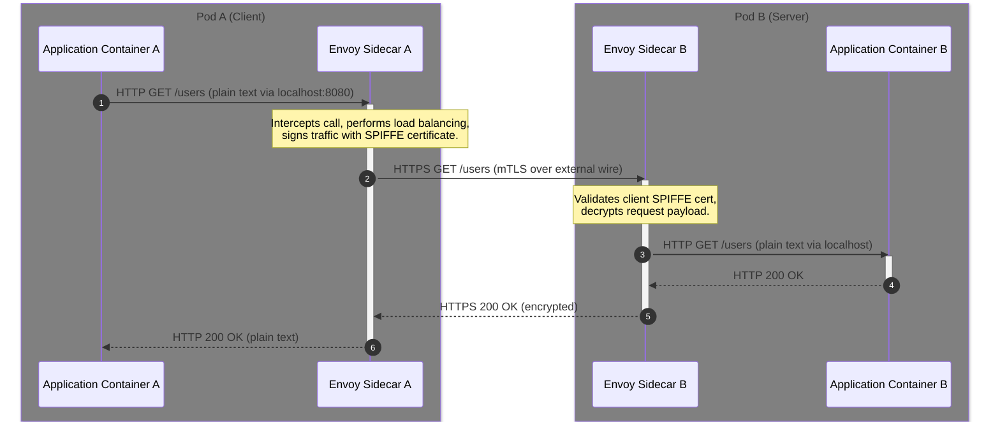

# The Sidecar Pattern: Service Meshes, Envoy, and Proxies

## The Problem: The "SDK Bloat" and Polyglot Friction

In a modern microservices architecture, application code is only a small fraction of what needs to be written. To make a distributed service resilient, secure, and observable, engineers must implement a vast layer of cross-cutting infrastructure concerns:

```
+-------------------------------------------------------------+
|                     Microservice Container                  |
|                                                             |
|  +-------------------------------------------------------+  |
|  |                   Application Logic                   |  |
|  +-------------------------------------------------------+  |
|  |     mTLS      |  Retries & timeouts  |   Metrics /    |  |
|  |  Encryption   |   Circuit Breakers   |  Trace Logs    |  |
|  +-------------------------------------------------------+  |
+-------------------------------------------------------------+
```

Historically, teams solved this by packaging these concerns into shared software libraries or SDKs (e.g., Spring Cloud, Netflix OSS). However, this creates three critical friction points in production:

1. **Polyglot Fragmentation:** If your Payment Service is written in Go, your Booking Service in Java, and your ML Engine in Python, you must write, maintain, and bug-fix three separate SDK implementations of mTLS, circuit breaking, and trace propagation.
2. **Upgrade Nightmares:** When a zero-day security vulnerability is discovered in an encryption or logging library, every single team across the organization must modify their dependencies, recompile their code, and redeploy their services.
3. **Application Pollution:** Application developers should focus on core business features. Forcing them to configure thread pools for network retries and manage TLS certificates dilutes their focus and introduces configuration drift.

---

## The Mental Model: The Co-Pilot (The Sidecar Process)

The **Sidecar Pattern** extracts these network-layer and operations-level concerns entirely out of the application code. It places them into a lightweight, high-performance helper proxy container that runs directly alongside the main application container within the same deployment unit (such as a Kubernetes Pod).

```
                 Kubernetes Pod Boundary (localhost network)
+--------------------------------------------------------------------------+
|  +------------------------+                  +------------------------+  |
|  | Application Container  | -- localhost --> |  Sidecar Proxy (Envoy) |  |
|  | (Go, Java, Python...)  | <-- localhost -- |                        |  |
|  +------------------------+                  +------------------------+  |
+------------------------------------------------------------------|-------+
                                                                   v
                                                            mTLS to Service B
```

Because both containers run within the same network namespace, they share the same loopback interface (`localhost`). The application container remains completely unaware of the outside world, sending and receiving all traffic locally. The sidecar intercepts all inbound and outbound network traffic, handling:
- **Mutual TLS (mTLS):** Automatically encrypting and validating peer identity.
- **Traffic Routing:** Dynamic routing, load balancing, canary deployments, and rate limiting.
- **Resilience:** Circuit breaking, connection pooling, health checking, and automatic retries.
- **Observability:** Collecting telemetry, metrics, and distributed tracing headers (e.g., Zipkin/Jaeger) without application intervention.

This decoupled architecture divides the service mesh into a **Data Plane** (the Envoy sidecar proxies moving packets) and a **Control Plane** (e.g., Istio, configuring the sidecars dynamically).

---

## The Architecture: Sidecar Traffic Interception Flow

Here is how traffic flows securely between two pods in a service mesh, managed entirely by their Envoy sidecars:



---

## Declarative Envoy Sidecar Configuration

The following YAML snippet is a conceptual Envoy routing and circuit breaker configuration. It demonstrates how easily retries and connection limits can be configured declaratively, entirely decoupled from the application code.

```yaml
static_resources:
  listeners:
  - name: outbound_listener
    address:
      socket_address: { address: 127.0.0.1, port_value: 9001 }
    filter_chains:
    - filters:
      - name: envoy.filters.network.http_connection_manager
        typed_config:
          "@type": type.googleapis.com/envoy.extensions.filters.network.http_connection_manager.v3.HttpConnectionManager
          stat_prefix: egress_http
          route_config:
            name: local_route
            virtual_hosts:
            - name: backend_service
              domains: ["*"]
              routes:
              - match: { prefix: "/" }
                route:
                  cluster: target_service_cluster
                  # Circuit breaking & resilience policies configured declaratively
                  retry_policy:
                    retry_on: "5xx,connect-failure,refused-stream"
                    num_retries: 3
                    per_try_timeout: 2s
          http_filters:
          - name: envoy.filters.http.router
            typed_config:
              "@type": type.googleapis.com/envoy.extensions.filters.http.router.v3.Router

  clusters:
  - name: target_service_cluster
    connect_timeout: 0.25s
    type: LOGICAL_DNS
    dns_lookup_family: V4_ONLY
    lb_policy: ROUND_ROBIN
    # Circuit Breakers to prevent cascading microservice failure
    circuit_breakers:
      thresholds:
      - priority: DEFAULT
        max_connections: 1024
        max_pending_requests: 100
        max_requests: 512
        max_retries: 3
    load_assignment:
      cluster_name: target_service_cluster
      endpoints:
      - lb_endpoints:
        - endpoint:
            address:
              socket_address: { address: production-api.internal, port_value: 443 }
```

---

## Actionable Takeaways

1. **Extract Infrastructure Concerns:** If you are building microservices in multiple programming languages, stop writing mTLS or circuit-breaking code inside application codebases. Move them to a sidecar container proxy.
2. **Utilize Shared Network Namespaces:** Take advantage of Kubernetes pod boundaries where containers share IP and `localhost` configurations, ensuring proxy interception is both seamless and low-latency.
3. **Decouple Security & Upgrades:** Keep your platform secure by updating your sidecar proxy images (e.g., upgrading Envoy version) centrally through your DevOps/Platform pipeline without forcing app dev teams to rebuild code.
