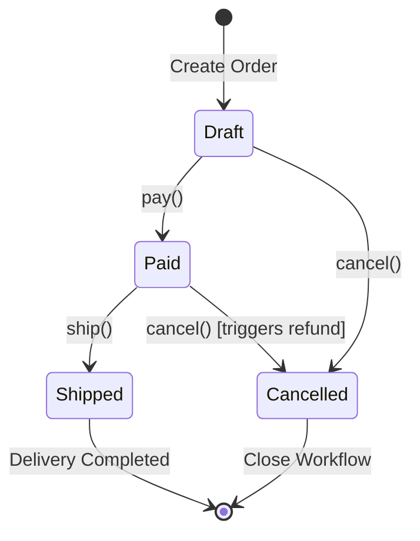

# The State Machine Design Pattern: Implementing Clear Workflows

## The Problem: The Nested "If-Else" Nightmare

In enterprise software engineering, business processes are almost always stateful. Consider a typical `Order` workflow with multiple states: `Draft`, `Paid`, `Shipped`, and `Cancelled`. 

Developers often write this state tracking natively inside a single god-class. When an event (like `pay` or `cancel`) occurs, they write highly nested conditional branches to determine what transitions are valid:

```python
# The classic "Anti-Pattern": Complex branching state logic
class NaiveOrder:
    def __init__(self):
        self.state = "DRAFT"

    def pay(self):
        if self.state == "DRAFT":
            self.state = "PAID"
            print("Payment processed.")
        elif self.state == "PAID":
            raise Exception("Order is already paid!")
        elif self.state == "SHIPPED":
            raise Exception("Cannot pay for an already shipped order.")
        elif self.state == "CANCELLED":
            raise Exception("Cannot pay for a cancelled order.")

    def cancel(self):
        if self.state == "DRAFT":
            self.state = "CANCELLED"
            print("Order cancelled.")
        elif self.state == "PAID":
            # Must process refund before cancelling
            self.refund_payment()
            self.state = "CANCELLED"
            print("Order refunded and cancelled.")
        elif self.state == "SHIPPED":
            raise Exception("Cannot cancel an order that has already shipped!")
        elif self.state == "CANCELLED":
            raise Exception("Order is already cancelled.")
```

This nested `if-else` or `switch-case` approach creates severe maintenance problems:
1. **Low Maintainability (Fragility):** Adding a new state (e.g., `Processing` or `PartiallyRefunded`) requires modifying every single transition method. Missing a single conditional check results in massive business bugs (e.g., letting a customer cancel an order that has already shipped).
2. **Lack of Separation of Concerns:** The context class (`Order`) must manage both its core state variables (items, delivery addresses) and the highly complex procedural logic of state transitions.
3. **Untestable Code Paths:** As states increase, the combinatorial explosion of conditional branches makes writing comprehensive unit tests a nightmare.

---

## The Mental Model: Polymorphic State Decoupling

The **State Pattern** solves this problem by moving state-specific behavior away from the context class and delegating it to separate, polymorphic state classes. 

Instead of an order checking `if state == "PAID"`, the order simply calls a method on its current `State` object. The active state object encapsulates exactly what is permitted in that specific state, seamlessly swapping the order's state to a new state class instance upon successful transition.

```
       +---------------+             delegates to             +-------------------+
       |     Order     | -----------------------------------> |       State       |
       | - state: State|                                      +-------------------+
               ^                                                        ^
               |                                                        |
               | sets new state                                   +-----+-----+
               |                                                  |           |
     +-------------------+                              +------------+ +------------+
     |     PaidState     |                              | DraftState | | PaidState  |
     +-------------------+                              +------------+ +------------+
```

This respects the **Single Responsibility Principle** and the **Open/Closed Principle**: you can add a brand-new state without modifying any of the existing state classes or the context class.

---

## The Design: Order State Machine Transitions

Here is the deterministic state machine for our order pipeline, detailing every allowed transition:



---

## Object-Oriented Implementation: Python State Pattern

The following Python implementation demonstrates the State Pattern, decoupling transitions into dedicated, testable classes while keeping the context interface clean and simple.

```python
from abc import ABC, abstractmethod

class OrderState(ABC):
    """Abstract State interface representing all allowed operations."""
    
    @abstractmethod
    def pay(self, order: 'Order') -> None:
        pass

    @abstractmethod
    def ship(self, order: 'Order') -> None:
        pass

    @abstractmethod
    def cancel(self, order: 'Order') -> None:
        pass


class DraftState(OrderState):
    def pay(self, order: 'Order') -> None:
        print("Processing payment...")
        order.transition_to(PaidState())

    def ship(self, order: 'Order') -> None:
        raise ValueError("Cannot ship an unpaid draft order.")

    def cancel(self, order: 'Order') -> None:
        print("Cancelling draft order.")
        order.transition_to(CancelledState())


class PaidState(OrderState):
    def pay(self, order: 'Order') -> None:
        raise ValueError("Order is already paid.")

    def ship(self, order: 'Order') -> None:
        print("Shipping order out...")
        order.transition_to(ShippedState())

    def cancel(self, order: 'Order') -> None:
        print("Issuing payment refund...")
        order.refund_customer()
        order.transition_to(CancelledState())


class ShippedState(OrderState):
    def pay(self, order: 'Order') -> None:
        raise ValueError("Cannot pay for a shipped order.")

    def ship(self, order: 'Order') -> None:
        raise ValueError("Order has already been shipped.")

    def cancel(self, order: 'Order') -> None:
        raise ValueError("Cannot cancel an order once it has been shipped!")


class CancelledState(OrderState):
    def pay(self, order: 'Order') -> None:
        raise ValueError("Cannot pay for a cancelled order.")

    def ship(self, order: 'Order') -> None:
        raise ValueError("Cannot ship a cancelled order.")

    def cancel(self, order: 'Order') -> None:
        raise ValueError("Order is already cancelled.")


class Order:
    """The Context class holding the current state and delegating operations."""
    
    def __init__(self):
        # Initial state is always Draft
        self._state: OrderState = DraftState()
        self.is_refunded = False

    def transition_to(self, state: OrderState) -> None:
        print(f"Transitioning from {self._state.__class__.__name__} to {state.__class__.__name__}")
        self._state = state

    def pay(self) -> None:
        self._state.pay(self)

    def ship(self) -> None:
        self._state.ship(self)

    def cancel(self) -> None:
        self._state.cancel(self)

    def refund_customer(self) -> None:
        self.is_refunded = True
        print("Refund processed successfully.")
```

---

## Actionable Takeaways

1. **Audit Branching Logic:** If you notice a class method containing more than three conditional blocks check-ins against a `self.status` or `self.state` variable, extract it to the State Pattern.
2. **Encapsulate Validation Rules:** Put state-specific transition checks inside the state subclasses, not the parent context class. This makes testing transitions as simple as isolating a single subclass.
3. **Keep Context Lightweight:** Keep your context class thin. The parent context should only act as a coordinator holding global data (e.g., database IDs, quantities) and routing calls to its active state object.
