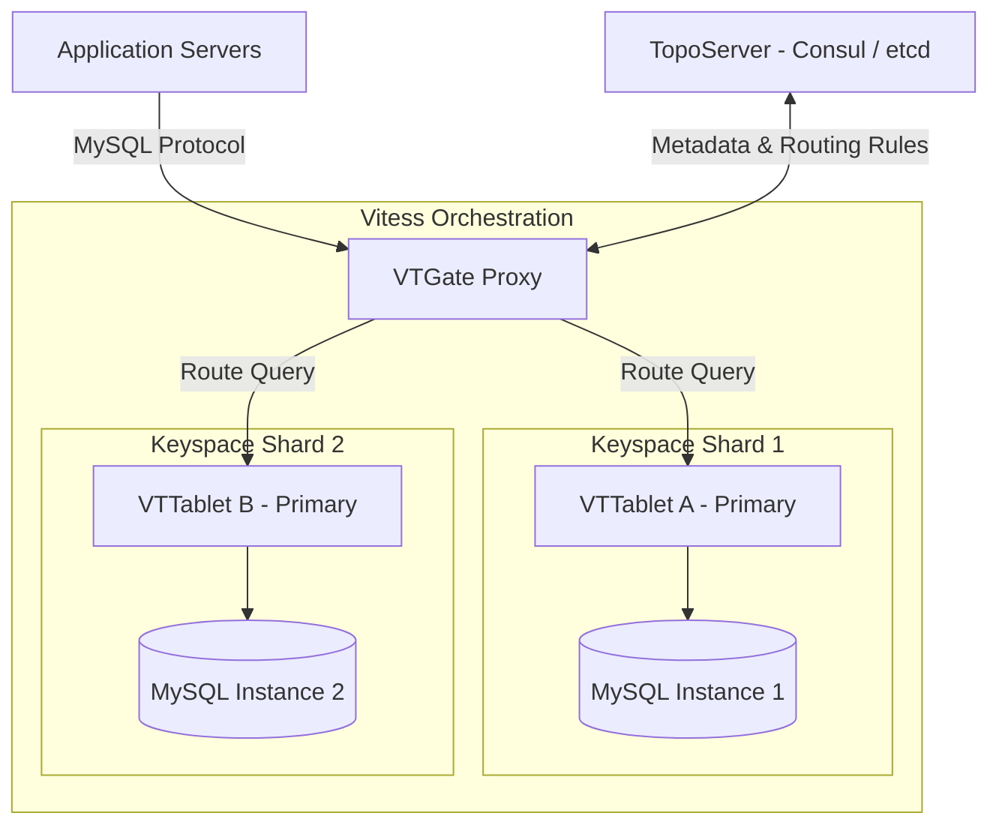

# Database Sharding: Horizontal Scaling of SQL Databases with Vitess

## The Problem: The Single-Instance Database Wall

In modern software development, scaling application servers is relatively straightforward: you spin up more container instances behind a stateless load balancer. However, scaling relational databases is a massive challenge. 

When your transactional write throughput exceeds what a single heavy bare-metal SQL server can support, standard strategies reach a hard ceiling:
1. **Vertical Scaling (Scaling Up):** Upgrading memory, CPU, or NVMe storage gets exponentially more expensive and eventually hits physical hardware limits.
2. **Read-Replicas:** Offloading read queries to secondary replicas is highly effective, but it does absolutely nothing to scale write capacity. Every write still must go to a single, overloaded primary instance.

```
                  +-----------------------------------+
                  |      Application Servers          |
                  +-----------------------------------+
                                    | (All writes)
                                    v
                  +-----------------------------------+
                  | Primary MySQL DB (Single-Instance)| <-- CPU & IOPS Exhausted!
                  +-----------------------------------+
```

To cross this limit, teams are forced to shard their database. **Database Sharding** partitions data horizontally across multiple physical database servers. 

However, implementing sharding inside application code is an architectural nightmare. Application code must now parse queries, identify the sharding key, route queries to the correct host, merge partial results from multiple shards, and orchestrate complex distributed transactions—completely polluting the domain logic and making raw SQL queries nearly impossible to write or maintain.

---

## The Mental Model: The Sharding Facade & Query Routing

Instead of forcing your application code to handle sharding logic, the modern architectural approach utilizes a **transparent proxy facade**. 

To the application, the proxy looks exactly like a single, massive MySQL instance. Behind the scenes, the proxy maps the database schema into logical shards and routes queries to their destination. This is where **Vitess** excels. Originally built by YouTube to scale MySQL to billions of queries per second, Vitess is a database orchestration engine that sits in front of a cluster of MySQL instances.

```
                  +------------------------------------+
                  |        Application Servers         |
                  +------------------------------------+
                                     | (Standard SQL)
                                     v
                  +------------------------------------+
                  |         Vitess VTGate Proxy        |
                  +------------------------------------+
                        |                      |
                        v                      v
                 +--------------+       +--------------+
                 |  Sharded DB1 |       |  Sharded DB2 |
                 +--------------+       +--------------+
```

Vitess organizes sharding using a declarative database schema called **VSchema** (Vitess Schema) and routes queries dynamically using two core sharding strategies:

### 1. Range-Based Sharding
Data is segmented based on predefined, continuous value ranges (e.g., User IDs 1-10,000 to Shard A, 10,001-20,000 to Shard B). This is simple to grasp but easily creates write hot-spots. If new sign-ups are assigned incremental IDs, all new writes will flood a single shard, rendering other shards idle.

### 2. Hash-Based Sharding
Data is distributed evenly across shards by running the sharding key (e.g., User UUID) through a cryptographic hashing function (like MD5 or MurmurHash3) and applying a modulo operation against the total number of shards. This completely eliminates hot-spots, ensuring write workloads are perfectly uniform across the global cluster.

---

## The Architecture: Vitess Cluster Topology

Here is the core routing and scaling topography of a Vitess-orchestrated MySQL database:



- **VTGate:** The stateless proxy layer that speaks the native MySQL protocol, parses SQL syntax, analyzes keyspace routing rules, and merges results.
- **VTTablet:** A management process running side-by-side with each MySQL instance to monitor health, enforce query limits, and report telemetry back to VTGate.
- **TopoServer:** A highly available coordination store (e.g., Consul, etcd) keeping routing metadata and cluster topologies synced.

---

## Declarative Routing: Conceptual Vitess VSchema Configuration

The following JSON snippet is a conceptual Vitess **VSchema** declaration. It maps the `users` table to a hash-based sharding key (known as a `vindex` in Vitess) on a keyspace called `user_keyspace`.

```json
{
  "sharded": true,
  "vindexes": {
    "hash_vindex": {
      "type": "hash"
    }
  },
  "tables": {
    "users": {
      "column_vindexes": [
        {
          "column": "user_id",
          "name": "hash_vindex"
        }
      ]
    },
    "orders": {
      "column_vindexes": [
        {
          "column": "user_id",
          "name": "hash_vindex"
        }
      ]
    }
  }
}
```

In this schema:
- A query like `SELECT * FROM users WHERE user_id = 42;` will be processed by VTGate, hashed, and surgically routed to the exact shard container hosting user 42.
- Because `orders` also shards on the same `user_id` column, Vitess places order rows for user 42 on the exact same physical shard. This co-location allows Vitess to perform **high-performance local SQL Joins** without resorting to slow, cross-network distributed joins.

---

## Actionable Takeaways

1. **Pick the Sharding Key (Vindex) Carefully:** This is your most critical choice. Shard on fields that naturally group related records together (e.g., `user_id` or `tenant_id`) to maximize local joins and avoid costly cross-shard network requests.
2. **Never Shard in Application Code:** Keep your application clean and maintainable. Use a database-agnostic scaling layer like Vitess (for MySQL) or Citus (for PostgreSQL) to handle query routing and transactional synchronization.
3. **Prefer Hash over Range Sharding for Write Workloads:** To scale massive transactional write volumes, select hash-based sharding keys to prevent hot-spotting and distribute writes evenly across physical instances.
