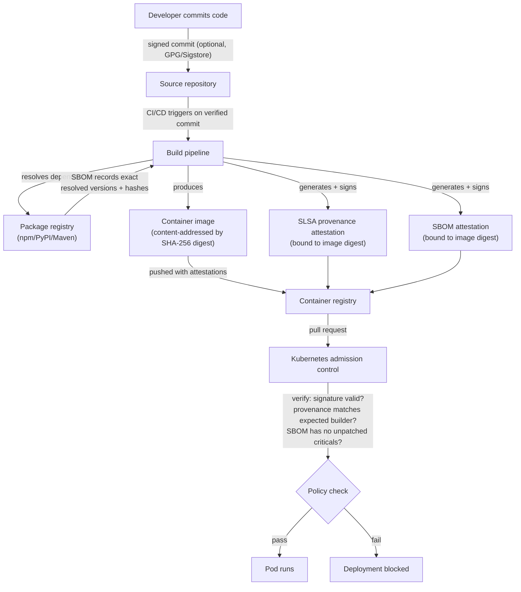

# Software Supply Chain Security Explained: SBOMs, Provenance, and Trust

> By the end of this article you'll be able to explain, mechanically, what an SBOM documents, what provenance proves, and how signing and attestations turn "this file appeared in my deployment pipeline" into "I can verify exactly where this came from and that nothing tampered with it along the way."

## The Problem

In December 2020, a routine software update from a network monitoring vendor called SolarWinds installed malware onto roughly 18,000 customer networks, including multiple U.S. federal agencies. The update was legitimately signed. It came from the vendor's real build system. Customers had done everything a security team is normally told to do — they patched promptly, they trusted a signed update from a known vendor — and it made no difference, because attackers had compromised the *build process itself*, inserting malicious code before the legitimate signing step ever ran.

> **Verification Note**
> The SolarWinds/SUNBURST incident's specific technical details (build-system compromise, the scope of affected organizations) are drawn from public post-incident reporting and CISA advisories current at the time of writing. Treat the narrative as directionally accurate industry context rather than a citation-grade technical account, and check current authoritative sources if you need incident specifics for a compliance or legal purpose.

Here's the uncomfortable lesson: **a valid signature only proves that whoever held the signing key approved of the bytes at the moment of signing.** It says nothing about what happened *before* that — which source code went in, which dependencies got pulled, whether a build server was compromised, whether a malicious commit slipped in upstream. Signing answers "who vouches for this," not "how did this actually get built."

That's the gap this article is about. Modern software isn't written — it's *assembled*. A single container image you deploy might contain your application code, a base OS image from a public registry, forty transitive open-source dependencies, a compiler toolchain, and build scripts pulled from a CI/CD marketplace. Every one of those is a place an attacker can insert something, and a single "it's signed" check at the very end catches none of them if the tampering happened earlier in the chain.

Software supply chain security is the discipline of answering three separate, precise questions about any artifact before you run it:

1. **What is actually in this thing?** (SBOM — Software Bill of Materials)
2. **How was it built, and by what?** (Provenance)
3. **Can I verify #1 and #2 are true, and haven't been tampered with?** (Signing and attestation)

## Why This Problem Is Hard

The obvious instinct is "just trust your vendors and scan for known vulnerabilities." That instinct fails for reasons worth naming precisely:

- **A vulnerability scanner only catches known-bad code.** CVE databases and static analysis tools find *known* vulnerable versions of *known* packages. They have nothing to say about a backdoor inserted by a compromised maintainer, a malicious package that has never been publicly flagged, or code that's functionally correct but was substituted for the real thing mid-pipeline. Scanning answers "is this version known to be bad," not "is this artifact what it claims to be."
- **Open-source dependency graphs are enormous and mostly invisible.** A modern application's *direct* dependencies might number a few dozen. Its *transitive* dependencies — the dependencies of your dependencies, recursively — routinely number in the hundreds or low thousands for a typical Node.js, Java, or Python project. Nobody manually reviews that graph, and most organizations, until recently, couldn't even produce a complete list of what was in it.
- **The build system is itself part of the attack surface, and it's usually the least scrutinized part.** Engineers review pull requests. Almost nobody reviews the CI/CD pipeline's build scripts, its plugin marketplace dependencies, or the permissions the build runner holds — and that's exactly where SolarWinds-style attacks land, because a compromised build step can inject code *after* code review has already approved the source.
- **Trust, once established, tends to get treated as permanent.** A team pins a base image, vendors a dependency, or trusts a registry once, and then stops asking "is this still the thing I trusted." Supply chains are not static — a package can be compromised long after you first added it, through a maintainer account takeover or a malicious version bump you never re-reviewed.

The common thread: **every point where an artifact changes hands or changes form — source to build, build to package, package to registry, registry to deployment — is a place where "what I think I'm running" and "what I'm actually running" can silently diverge.** Supply chain security is the set of controls that closes that gap at every handoff, not just the last one.

## A Simple Mental Model

Think about a shipping container arriving at a port.

A customs inspector doesn't just check that the container has a seal on the door (that's the equivalent of "it's signed"). A tamper-evident seal only proves nobody opened *this specific door* since it was closed. It says nothing about what was loaded into the container in the first place, whether the manifest matches the actual contents, or whether the truck that delivered it to the port took a suspicious detour through an unmonitored warehouse along the way.

A rigorous inspection regime needs three separate things, and they map directly onto our three questions:

- **A manifest** — an itemized list of exactly what's inside the container, so you can check contents against a declared list (the **SBOM**).
- **A chain-of-custody record** — where the container was packed, by whom, on what dock, following what loading procedure, with what security controls at each step (the **provenance**).
- **A verifiable, tamper-evident seal that cryptographically ties the manifest and the chain-of-custody record to *this specific container*** — not a seal you could move to a different container, and not one that can be forged by someone who never actually had custody of the goods (**signing and attestation**).

Where the analogy strains: a shipping container's manifest is written once, by hand, and trusted on faith. A software SBOM and its provenance record are, ideally, generated *automatically* by the build system itself and cryptographically bound to the artifact — which means the interesting engineering problem isn't "write the paperwork," it's "make the paperwork impossible to fake or omit without the fakery being detectable." That's the part a shipping-container metaphor can't teach you, and it's where the rest of this article lives.

## Before We Continue

This article assumes you're comfortable with a few things from adjacent parts of this knowledge base, and doesn't re-derive them:

- **Cryptographic hashing** — that a hash function like SHA-256 produces a fixed-length digest of arbitrary input, that changing even one bit of the input produces a completely different digest, and that this makes hashes suitable as tamper-evident fingerprints. See *The Fall of MD5 and SHA-1* for why weaker hash functions can't be trusted for this.
- **Digital signatures and PKI** — that a private key can sign data to produce a signature only that key could have produced, that a corresponding public key lets anyone verify the signature, and that X.509 certificates and certificate chains are how a public key gets tied to an identity you can decide to trust. See *Digital Signatures: The Mathematics of ECDSA Verification* and *X.509 PKI: Navigating the Certificate Chain of Trust*.
- **Container images and Kubernetes** — that a container image is a layered filesystem plus metadata, addressable by a content hash (its digest), pulled from a registry and run by an orchestrator. See *Docker Container Security* and *Kubernetes Explained Through a Real Application*.
- **OAuth/OIDC basics** — that an OIDC identity token is a signed, verifiable claim about who or what is making a request, issued by a trusted identity provider. This matters later when we get to *keyless* signing, which uses exactly this mechanism instead of a long-lived private key.

## A Concrete Dependency Chain

To keep the rest of this article grounded, we'll follow one running example: a small internal service, `billing-api`, going from source code to a running pod in production.

```
Developer laptop
      │  git push
      ▼
Source repository (GitHub)
      │  triggers
      ▼
CI/CD build pipeline
      │  pulls
      ▼
Open-source dependencies (npm/PyPI/Maven registry)
      │  compiles + packages
      ▼
Container image (built FROM a public base image)
      │  pushed to
      ▼
Container registry
      │  pulled by
      ▼
Kubernetes cluster → running pod
```

Every arrow in that diagram is a handoff, and every handoff is a place something can go wrong:

| Handoff | What can go wrong |
|---|---|
| Developer → source repo | A compromised developer account or a malicious commit that passes review because a reviewer doesn't catch it |
| Source repo → CI/CD | A compromised build server, a malicious CI plugin, or a pipeline definition that was tampered with |
| Registry → build | A dependency that's been compromised, hijacked, or was never what its name implied (dependency confusion, typosquatting) |
| Build → image | A build step that injects code after the source was already reviewed and approved |
| Image → registry | An image tag that gets silently replaced by a different, malicious image with the same tag |
| Registry → cluster | A cluster that pulls whatever image matches a tag, with no way to verify it's the artifact that was actually built and reviewed |

Notice something important: **none of these attack points are closed by "scan the final container image for known CVEs."** A scanner looking at the finished `billing-api` image has no way to tell you whether the `left-pad`-equivalent dependency it pulled in was the real package or a typosquatted lookalike, whether the build ran on a compromised runner, or whether the image in the registry is actually the one the pipeline produced. That's precisely the gap SBOMs, provenance, and attestation exist to close — and we'll walk this exact chain again once each control is on the table.

## The Core Idea: Three Questions, Three Controls

### 1. The SBOM: "What Is Actually In This?"

A **Software Bill of Materials (SBOM)** is a structured, machine-readable inventory of every component in a piece of software — direct dependencies, transitive dependencies, their versions, their licenses, and (ideally) enough identifying detail to look each one up in a vulnerability database.

Think of it as the ingredients label on packaged food, except recursive: not just "contains wheat," but "contains flour, which contains wheat grown in field X, milled at facility Y." An SBOM for `billing-api` doesn't just say "depends on `express`" — it says depends on `express@4.19.2`, which depends on `body-parser@1.20.2`, which depends on `bytes@3.1.2`, and so on down the full transitive graph.

Two standard, competing-but-largely-interoperable formats dominate:

- **SPDX** (Software Package Data Exchange) — originally focused heavily on license compliance, now a full component-and-relationship format, standardized through the Linux Foundation and ISO/IEC 5962.
- **CycloneDX** — originated in the OWASP ecosystem, designed from the outset with security use cases (vulnerability correlation, VEX — Vulnerability Exploitability eXchange — statements) as a first-class concern.

> **Verification Note**
> Both formats evolve actively; field-level structure and the current standardization status of each should be checked against their respective specifications (spdx.dev, cyclonedx.org) before building tooling against a specific version.

Here's a deliberately simplified fragment of what a CycloneDX SBOM entry looks like for one dependency in our chain:

```json
{
  "bomFormat": "CycloneDX",
  "specVersion": "1.5",
  "components": [
    {
      "type": "library",
      "name": "express",
      "version": "4.19.2",
      "purl": "pkg:npm/express@4.19.2",
      "hashes": [
        { "alg": "SHA-256", "content": "a1b2c3...redacted-for-example" }
      ],
      "licenses": [{ "license": { "id": "MIT" } }]
    }
  ]
}
```

The `purl` (Package URL) is worth noticing — it's a standardized way of naming "this exact package, from this exact ecosystem, at this exact version" that tooling across the industry can parse consistently, regardless of whether the package came from npm, PyPI, Maven Central, or a container registry.

**What an SBOM buys you:**

- When a new CVE is disclosed for, say, a specific version of a logging library, you can query "which of our deployed artifacts contain this exact version" in seconds instead of manually auditing every service — this is precisely the capability the industry was missing during incidents like the Log4Shell disclosure in late 2021, when organizations without SBOMs spent days just figuring out *where* the vulnerable library was even used.
- License compliance becomes queryable instead of a manual legal review.
- You can diff two SBOMs across a version bump and see exactly what changed in the dependency graph — which is precisely the mechanism that lets an automated dependency-upgrade process (or an AI agent doing one) flag "this upgrade quietly pulled in a new transitive dependency neither of us has reviewed" instead of silently trusting a lockfile diff.

**What an SBOM does *not* buy you.** This is the detail every team gets wrong at first: an SBOM is a *declaration*, not a *guarantee*. A generated SBOM tells you what the build tool *believes* it included. It does nothing, by itself, to prove the build that produced it wasn't tampered with, that the listed components are the ones that actually ended up in the running artifact, or that no unlisted code snuck in. **An SBOM without provenance and signing is a list you have to trust on faith** — which is exactly the problem we started with.

### 2. Provenance: "How Was This Built, and By What?"

**Provenance** is a verifiable record of the process that produced an artifact: which source commit, on which build system, using which build steps, with which inputs, at what time. It's the chain-of-custody record from the shipping-container analogy.

It helps to separate two provenance questions that are easy to conflate:

- **Build provenance** answers: *what process produced this artifact?* Which CI system ran, which pipeline configuration, which commit SHA was checked out, which build command executed.
- **Artifact provenance** answers: *what does this specific artifact's history look like, all the way back?* Not just the last build step, but the full lineage — which source repo, which dependencies were resolved at build time, which prior artifacts (like a base image) it was built from.

The industry-standard framework for reasoning about this is **SLSA** (Supply-chain Levels for Software Artifacts, pronounced "salsa"), originally developed at Google and now a Linux Foundation / OpenSSF project. SLSA defines increasing levels of build integrity:

> **Verification Note**
> SLSA's level definitions have been revised across major spec versions (notably v0.1 through v1.0), and the exact number and naming of levels has changed. The description below reflects the general shape of the framework's build-track levels as of SLSA v1.0; check slsa.dev for the current authoritative definitions before using this for a compliance requirement.

- **Build L0** — no guarantees. Anyone can produce an artifact claiming to be this software, however they like.
- **Build L1** — the build process is scripted and produces provenance describing itself, but that provenance isn't independently verified or tamper-resistant.
- **Build L2** — the build runs on a hosted build platform that generates signed provenance, so a consumer can verify who ran the build and that the provenance wasn't forged after the fact.
- **Build L3** — the build platform enforces strong isolation between builds (one build cannot tamper with another or with the provenance-generation process itself), closing the exact class of attack that let SolarWinds happen: a compromised build step secretly altering output *before* signing.

The point of a leveled framework isn't to chase the highest number for its own sake — it's to let a consuming team ask a precise question: *"what class of tampering does this artifact's build process actually rule out?"* instead of an unfalsifiable "we trust our vendor."

A build provenance statement, in practice, is typically an **in-toto attestation** (a standardized, signed statement format originating from the in-toto project) carrying a payload like:

```json
{
  "predicateType": "https://slsa.dev/provenance/v1",
  "subject": [
    {
      "name": "ghcr.io/example-org/billing-api",
      "digest": { "sha256": "9f86d0...redacted-for-example" }
    }
  ],
  "predicate": {
    "buildDefinition": {
      "buildType": "https://actions.github.io/buildtypes/workflow/v1",
      "externalParameters": {
        "workflow": {
          "repository": "https://github.com/example-org/billing-api",
          "ref": "refs/heads/main",
          "path": ".github/workflows/build.yml"
        }
      },
      "resolvedDependencies": [
        { "uri": "git+https://github.com/example-org/billing-api@abc123..." }
      ]
    },
    "runDetails": {
      "builder": { "id": "https://github.com/actions/runner" },
      "metadata": { "invocationId": "run-4821093" }
    }
  }
}
```

Notice the `subject` field: the provenance statement is bound to a *specific content-addressed digest* (`sha256:9f86d0...`), not a mutable tag like `billing-api:latest`. This is the detail that makes provenance actually verifiable rather than aspirational — a tag can be silently repointed at a different image; a SHA-256 digest cannot represent two different sets of bytes.

### 3. Signing and Attestation: "Can I Verify Any of This?"

An SBOM and a provenance statement are just JSON documents sitting next to your artifact until something makes them **tamper-evident and attributable**. That something is a **digital signature**.

The traditional model: generate a private/public key pair, keep the private key extremely well protected (an HSM, ideally), sign the artifact (or its SBOM, or its provenance statement) with the private key, and publish the public key so anyone can verify the signature. This works, but it inherits a hard operational problem familiar from PKI generally: **key management.** Long-lived signing keys are high-value targets, they need rotation, revocation, and secure storage, and a leaked signing key silently undermines every signature it ever produced or ever will produce until the compromise is discovered.

This is the specific problem **Sigstore** was built to address, through a mechanism usually called **keyless signing**:

1. A developer or, far more commonly, a CI/CD pipeline requests a signing operation.
2. Instead of using a stored private key, the signer authenticates via **OIDC** — proving "I am this specific GitHub Actions workflow, on this specific repository" (or an equivalent identity claim) using the same OIDC mechanism covered in this knowledge base's identity-access articles.
3. Sigstore's certificate authority (**Fulcio**) issues an extremely short-lived certificate binding a freshly generated key pair to that verified OIDC identity — short-lived enough that it doesn't need traditional revocation infrastructure; it simply expires within minutes.
4. The artifact is signed with that ephemeral key.
5. The signature, certificate, and a record of the whole transaction are recorded in **Rekor**, a public, append-only transparency log (built on the same class of Merkle-tree structure covered in this knowledge base's certificate-transparency material) — so the signing event is publicly auditable and can't be quietly created or deleted after the fact.

The practical payoff: **nobody has to guard a long-lived private key**, because there isn't one to steal — the key exists for the lifetime of one signing operation and is backed by an identity you can independently verify against your CI/CD provider's own OIDC issuer.

In practice, this is invoked through **Cosign**, the signing client most commonly paired with Sigstore:

```bash
# Sign a container image using keyless (OIDC-based) signing
cosign sign ghcr.io/example-org/billing-api@sha256:9f86d0...

# Attach the SBOM as a signed attestation on the same image
cosign attest --predicate sbom.cdx.json \
  --type cyclonedx \
  ghcr.io/example-org/billing-api@sha256:9f86d0...

# Verify the image's signature came from the expected CI identity
cosign verify \
  --certificate-identity "https://github.com/example-org/billing-api/.github/workflows/build.yml@refs/heads/main" \
  --certificate-oidc-issuer "https://token.actions.githubusercontent.com" \
  ghcr.io/example-org/billing-api@sha256:9f86d0...
```

That last command is the crucial one, and it's worth reading closely: `cosign verify` isn't just checking "is there *a* valid signature" — it's checking that the signature's identity matches a *specific expected workflow, on a specific repository, on a specific branch*. That's the difference between "someone with a Sigstore identity signed this" and "the artifact I expect to have built this actually built this."

## Under the Hood: Walking the Chain With Controls Applied

Let's re-run the `billing-api` example, now with SBOMs, provenance, and signing at each handoff:



Walk the handoffs again with this in place:

- **Developer → source repo**: an optional but valuable control here is signed commits, so the repository can enforce that every commit on a protected branch has a verifiable author identity — closing part of the "compromised developer account" gap, though it doesn't fully close it (a compromised, legitimately-signing developer account is still a real residual risk).
- **Registry → build**: the SBOM generated during the build records the *exact resolved versions* pulled from the registry, with hashes — so a dependency-confusion attack (where a malicious package with the same name gets resolved from a different registry than intended) becomes detectable after the fact, because the SBOM will show a package hash that doesn't match what a legitimate build should have produced.
- **Build → image**: the SLSA provenance attestation records which build definition ran, on which builder, from which commit — this is the control that directly addresses the SolarWinds scenario, because a build step that injects code *after* review but *before* signing now has to also forge a provenance statement claiming a build process that never happened, which is exactly what a hosted, isolated build platform (SLSA Build L3) is designed to prevent it from doing undetected.
- **Image → registry, registry → cluster**: because the image is referenced by its content digest and both the SBOM and provenance are cryptographically bound to that same digest, there's no point in this path where a tag can be quietly repointed at a different image without the signature verification failing.
- **Registry → cluster (final gate)**: Kubernetes admission control (frequently implemented with tools like Sigstore's `policy-controller`, or general-purpose policy engines) can *refuse to schedule* any pod whose image doesn't carry a valid signature from an expected identity, valid provenance from an expected build system, and an SBOM free of unpatched critical vulnerabilities — turning "we hope everything upstream was fine" into an enforced, machine-checked gate at the one point that actually matters: right before the code runs.

## What Can Go Wrong?

Adopting SBOMs, provenance, and signing doesn't make a supply chain secure by default — several concrete failure modes show up in practice:

- **Treating SBOM generation as a checkbox, not a verification step.** A tool that emits an SBOM listing dependencies, without anyone ever checking that SBOM against actual known-vulnerable packages or actually verifying its signature at deployment time, produces a document nobody reads — pure compliance theater with no security effect.
- **Trusting provenance without checking the identity in it.** `cosign verify` without `--certificate-identity` and `--certificate-oidc-issuer` will happily confirm "yes, *someone* with *a* Sigstore identity signed this" — which is nearly meaningless on its own. The verification only has teeth when it checks that the identity matches the *specific* build system you expect, exactly as shown in the example above.
- **Dependency confusion and typosquatting still work against an SBOM that isn't cross-checked.** If your build resolves `internal-auth-lib` from a public registry because an internal package name collided with a public one, your SBOM will faithfully record exactly what it pulled — a malicious package, correctly documented. The SBOM tells you the truth about a bad decision; it doesn't make the decision for you. This is precisely why registry configuration (scoped package namespaces, private-registry-first resolution) remains a necessary control alongside SBOMs, not a control SBOMs replace.
- **A stale SBOM.** An SBOM generated once at release time and never regenerated becomes wrong the moment a patched dependency is silently backported into a running image, or the moment new information about an old dependency emerges. SBOMs need to be a build-time artifact regenerated on every build, and ideally re-evaluated against fresh vulnerability data continuously, not a document written once and filed away.
- **A build platform with weak isolation defeats provenance's whole purpose.** Provenance signed by a build system that itself allows one job to tamper with another job's environment (shared runners with insufficient isolation, mutable build caches an attacker can poison) produces a *valid, truthfully-signed* attestation about a *compromised* build — this is exactly the gap between SLSA Build L2 and Build L3, and it's not a paperwork problem, it's an infrastructure isolation problem.
- **Signing the wrong thing.** Signing a container image tag instead of its content digest reintroduces the exact mutability problem signing was supposed to close — a tag is a mutable pointer, not an immutable artifact identity.

## Security Considerations

It's worth being explicit about which attacker capabilities each control does and doesn't address, using the standard security chain: asset → threat → mitigation → residual risk.

**Asset:** the integrity of the software you deploy — the guarantee that what runs in production is what your organization actually reviewed and built.

| Attack | Mitigated by | Residual risk |
|---|---|---|
| Typosquatted or dependency-confused package pulled into the build | SBOM (makes the substitution visible after the fact) + registry scoping (prevents it up front) | SBOM alone is forensic, not preventive — it tells you what happened, not that it won't |
| Compromised build server injecting code post-review, pre-signing | SLSA build provenance + isolated, hosted build platforms (Build L3) | A build platform provider's own infrastructure compromise is outside your control; you're trusting their isolation guarantees |
| Stolen long-lived signing key | Keyless signing (Sigstore/Fulcio) — no long-lived key exists to steal | The OIDC identity provider itself becomes a high-value target; compromising *it* still lets an attacker mint valid signatures |
| Tag-repointing / image substitution after the fact | Content-addressed digests + signatures bound to the digest | Only holds if every consumer actually verifies by digest and signature — a consumer that pulls by mutable tag without verification bypasses this entirely |
| Vulnerable dependency shipped unknowingly | SBOM cross-referenced against vulnerability databases | Zero-day and unknown-unknown vulnerabilities aren't in any database yet; SBOMs only help with *known* issues |
| Malicious insider with legitimate signing rights | None of the above — this is an authorization/least-privilege problem, not a supply-chain-provenance problem | Requires separate controls: least privilege, multi-party approval for releases, audit logging |

The last row matters more than it might look: **supply chain security controls answer "is this artifact what it claims to be and how it claims to have been built," not "should this person have been allowed to build and sign it in the first place."** That second question is an identity, authorization, and least-privilege problem, and it doesn't go away just because your SBOMs and signatures are impeccable.

## Common Misconceptions

**Misconception: An SBOM is basically the same thing as a `package-lock.json` or `requirements.txt`.**
**Reality:** A lockfile is an input to the build, pinned by the developer, and trusted on faith. An SBOM is (ideally) generated by observing what the build *actually* resolved and included, in a standardized, tool-interoperable format that supports automated vulnerability correlation across your entire fleet — not just one project's own dependency list. A lockfile tells the build what to fetch; an SBOM records what was actually used.

**Misconception: Signing an artifact proves it's safe.**
**Reality:** A signature proves attribution and integrity — *who* signed it and that it hasn't been altered since. It says nothing about whether the code is well-written, free of vulnerabilities, or was built from a trustworthy process. SolarWinds's malicious update was signed. Signing without provenance answers "who vouches for these exact bytes," not "were these bytes produced safely."

**Misconception: SLSA is a certification you either have or don't.**
**Reality:** SLSA is a framework of levels describing specific, checkable properties of a build process. Different artifacts in the same organization can legitimately sit at different levels, and the honest engineering question is always "which specific tampering scenario does this level rule out," not "are we SLSA compliant" as a binary label.

**Misconception: Once you generate an SBOM and sign your artifacts, the supply chain is secured.**
**Reality:** These controls make tampering *detectable and attributable* — they don't make your dependencies secure, your build infrastructure well-isolated, or your registry properly access-controlled. They're necessary complements to those other controls, not a replacement for them.

## Real-World Architecture

The pattern that has emerged across major cloud providers and open-source tooling converges on the same shape: **generate provenance and an SBOM as a mandatory, automated step of every build (not an optional add-on)**, **sign both, bound to the artifact's content digest**, and **enforce verification at the one point that actually matters — right before the artifact is allowed to run**, typically via admission control in the orchestrator.

Concretely, this tends to show up as:

- A CI/CD platform's native support for generating signed provenance automatically (for example, GitHub Actions' built-in artifact attestations, or an equivalent feature in other major CI providers) rather than every team hand-rolling their own signing step.
- A software composition analysis (SCA) tool integrated into the pipeline that generates the SBOM and cross-references it against vulnerability feeds as a build gate, not a nightly batch report.
- Cluster-level admission policy that refuses to schedule any workload whose image can't be verified against an organization-defined policy (expected signer identity, minimum SLSA level, no unpatched critical CVEs in the SBOM).
- A private, access-controlled artifact registry that mirrors vetted upstream dependencies, so the build never resolves directly against the public internet at all — closing the dependency-confusion and typosquatting attack surface at the source, rather than relying entirely on after-the-fact detection.

## Expert Insight

The teams that get this right treat the SBOM and provenance record as **outputs of the build, generated automatically, every time** — never as a document a human writes after the fact from memory. The moment SBOM generation becomes a manual, occasional task, it silently drifts out of sync with reality, and an out-of-date SBOM is arguably worse than none, because it creates false confidence.

The other lesson that takes teams a while to internalize: **verification has to happen where the artifact is about to run, not just where it's built.** A beautifully signed, fully-attested artifact that a Kubernetes cluster will happily run regardless of whether the signature checks out has all the supply-chain machinery and none of the actual protection — the enforcement point is what converts "we could theoretically detect tampering" into "tampered artifacts don't run." This is the same lesson zero-trust architecture teaches in the identity world: verification that isn't enforced at the point of access isn't a control, it's documentation.

Finally, it's worth being honest about what this doesn't solve: none of this stops a legitimate, authorized engineer from writing and correctly signing genuinely bad code. Supply chain security closes the "is this what it claims to be" gap — code review, testing, and security review still own the "is this actually good code" gap, and conflating the two is how organizations end up over-trusting a green checkmark that was never meant to certify code quality in the first place.

## Try It Yourself

**Goal:** Get hands-on experience generating, signing, and verifying an SBOM and image signature for a real container image, using free open-source tooling.

**Starting Point:** A working Docker installation and a small container image you can build locally (or any public image you have permission to inspect, such as an official base image).

**Task:**
1. Install `syft` (an open-source SBOM generator) and generate a CycloneDX SBOM for a container image: `syft <image> -o cyclonedx-json > sbom.json`. Open the output and find one transitive dependency you didn't know was in there.
2. Install `cosign` and generate a local key pair with `cosign generate-key-pair`, then sign the image: `cosign sign --key cosign.key <image>`.
3. Attach the SBOM you generated as an attestation: `cosign attest --key cosign.key --predicate sbom.json --type cyclonedx <image>`.
4. Verify both: `cosign verify --key cosign.pub <image>` and `cosign verify-attestation --key cosign.pub --type cyclonedx <image>`.
5. Now tamper: modify one byte of the SBOM file and try to re-attach it without re-signing. Observe what verification does.

**Expected Result:** The first verification succeeds. After tampering with the SBOM without re-signing, verification of the attestation fails — because the signature is bound to the exact bytes of the predicate, not just "an SBOM exists."

**What You Learned:** A signature isn't a label attached loosely to an artifact — it's a cryptographic binding to the *exact* content, and any modification, however small, breaks verification. This is the mechanical property every claim in this article about "tamper-evident" rests on.

## Pause and Think

> **Critical Question:** Your organization signs every container image with Cosign and generates an SBOM on every build. A vulnerability researcher discloses a critical CVE in a logging library your services depend on. Your SBOMs let you instantly identify every affected service. Have you fully solved the incident-response problem?

### Answer

No — and the gap is worth naming precisely. The SBOM answers "where is this dependency used," which is a massive improvement over manually auditing every service, but it doesn't tell you whether the vulnerable code path is actually *reachable* in your specific usage (a vulnerability in a rarely-called function might be present but not exploitable in your configuration), doesn't patch anything for you, and doesn't verify that your remediation actually removed the vulnerable version from every running instance rather than just the source repository. SBOMs turn "where is this" from a multi-day forensic exercise into a query — they don't replace triage, patching, redeployment, and re-verification that the new artifact (with a new SBOM, a new signature, and new provenance) is actually what's now running everywhere it needs to be.

## Key Takeaways

- An **SBOM** is a machine-readable inventory of everything inside an artifact — it answers "what's in here," not "can I trust it." It's a declaration, and declarations need verification.
- **Provenance** answers "how was this built, by what, from what" — build provenance (the process) and artifact provenance (the full lineage) are related but distinct, and the **SLSA** framework gives you a concrete, checkable way to reason about how strong that guarantee actually is.
- **Signing**, done well, is bound to a content-addressed digest, not a mutable tag — and modern **keyless signing** (Sigstore/Fulcio/Rekor) replaces long-lived private keys with short-lived, OIDC-identity-bound certificates, closing the key-theft problem that plagued traditional code signing.
- None of these three controls work in isolation. An SBOM without provenance is a list you trust on faith. Provenance without signing can be forged. A signature without checking the *specific expected identity* just proves *someone* signed it.
- The enforcement point that actually matters is the last one — admission control at deployment time, refusing to run anything that doesn't pass verification. Generating attestations nobody checks is compliance theater, not security.
- These controls close the "is this artifact what it claims to be" gap. They do not replace code review, dependency vetting, least privilege, or the judgment calls that decide whether code is *good*, not just *authentic*.

## What to Learn Next

- **"AI Supply Chain Risk: Securing Models, Datasets, and Weights"** — the same provenance and trust questions applied to model weights, training data, and the AI-specific supply chain, where a `pickle`-based serialization format introduces attack surface a traditional software SBOM was never designed to cover.
- **"AI Agents for Dependency Upgrades"** — how an autonomous agent should use SBOM diffing and provenance verification as guardrails when it proposes a dependency version bump, rather than trusting a lockfile change blindly.
- **"GCP Workload Identity Federation: Eliminating Static Keys in GitHub Actions Pipelines"** — the same "replace a long-lived secret with short-lived, identity-bound trust" pattern that underlies keyless signing, applied to cloud credential access instead of code signing.
