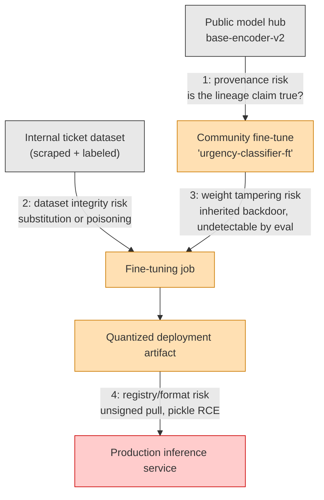
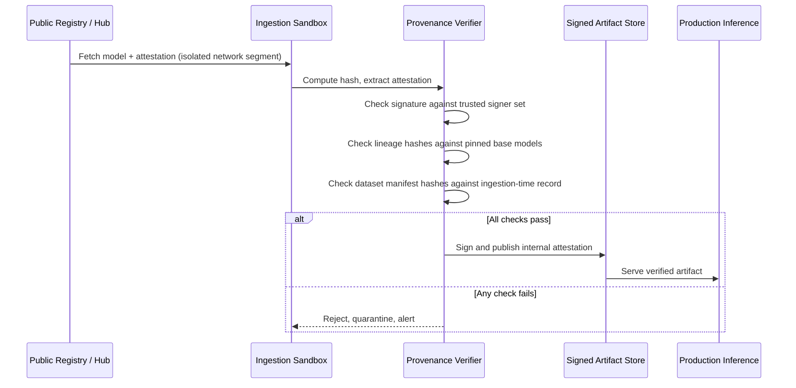

# AI Supply Chain Risk: Securing Models, Datasets, and Weights

> By the end of this article you'll be able to name every stage where an AI system's supply chain can be compromised — code, data, and weights alike — and build a verification pipeline that catches tampering before a model reaches production.

## The Problem

Say your team needs a sentiment classifier fine-tuned for customer support tickets. Someone on the team finds a promising base model on a public model hub, downloads a community fine-tune of it, pulls a labeled dataset to further tune it for your domain, and ships the result behind an API in about an afternoon.

Now ask the question a security engineer is paid to ask: what did you actually just deploy?

You didn't write the base model's architecture. You didn't see the data it was pretrained on. You didn't review the fine-tuning code the community contributor used, and you almost certainly didn't re-run their training job to confirm it does what the README claims. You downloaded a few gigabytes of floating-point numbers, ran `from_pretrained(...)`, and trusted that the numbers represent what they say they represent.

Compare that to a normal software dependency. If you `npm install` a suspicious package, you can `npm view` its source, diff it against the previous version, run it through a static analyzer, or just read it — it's text. A neural network's weights are not text. A 7-billion-parameter model is roughly 14GB of numbers with no comments, no variable names, and no human-readable logic. You cannot "read the diff" between a clean checkpoint and a backdoored one. This is the problem this article is about: **the AI supply chain has all the risks of the traditional software supply chain, plus a class of risk that traditional supply chain security has no tooling for at all.**

## Why This Problem Is Difficult

Traditional software supply chain security (see the SBOM/provenance article referenced above) is built on an assumption that mostly holds for source code: artifacts are inspectable, builds are reproducible-ish, and a compromise usually leaves a diffable trace — an extra line in a `package.json`, an unexpected `curl | bash` in a build script, a hash mismatch on a tarball.

None of those assumptions transfer cleanly to AI artifacts:

| Traditional software | AI/ML artifact |
|---|---|
| Source code is human-readable | Weights are matrices of floats — unreadable, undiffable |
| A build is (mostly) deterministic from source + lockfile | Training involves randomness, hardware nondeterminism, and hyperparameters that are often undocumented |
| A dependency graph has a small number of well-defined nodes (packages) | A model has a lineage graph: base model → distillation → fine-tune → quantization → LoRA adapter merge — each hop from a *different, possibly untrusted* party |
| Tampering usually means inserting new logic | Tampering can mean *nudging existing weights slightly* — no new code, no new files, just different numbers |
| A vulnerability scanner can pattern-match known-bad code | There is no static scanner that can look at a weight tensor and say "this is backdoored" |
| The artifact you ship is the artifact you audit | The artifact you ship (a fine-tuned model) may behave differently from the artifact you audited (the base model), because fine-tuning is itself a transformation you usually didn't observe |

That last row is the crux of it. In software supply chain security, provenance answers "what code produced this binary?" In AI supply chain security, provenance has to answer a strictly harder question: "what *data*, what *base weights*, and what *training process* produced this behavior?" — and behavior is the thing you actually care about, not the bytes.

## A Simple Mental Model

Think of a traditional software build as a **recipe with readable ingredients**: you can look at the flour, taste the sauce, and if something's off you can usually smell it. A trained model is closer to a **finished dish you can't take apart**. You can taste it (run evaluations), but a sufficiently subtle poison doesn't change the taste at all — it only activates under one specific, rare condition the taster never tries. Evaluation suites are your only "taste tests," and an attacker who knows your test menu can poison the dish so it passes every test you're likely to run and only misbehaves on the one dish nobody ordered.

This analogy has a limit worth stating explicitly: unlike food, a model's "recipe" (training code, hyperparameters, data manifest) can, in principle, be recorded and cryptographically bound to the finished artifact. That's exactly what provenance attestation is for — turning "trust me, I trained it correctly" into "here is a signed, verifiable record of exactly what went in."

## Before We Continue

This article assumes you're comfortable with:

- How LLMs and fine-tuning pipelines fit together end to end (base pretraining → instruction tuning → adapters/LoRA → quantization/deployment) — see the LLM engineering and fine-tuning prerequisites.
- Basic public-key cryptography: what a digital signature proves, and what a hash proves versus what it doesn't (integrity, not trust).
- General container/artifact supply chain concepts — SBOMs, build provenance, and why "where did this artifact come from" became a security question in the first place.

If any of those feel shaky, the "Software Supply Chain Security Explained" and "Digital Signatures" prerequisites are the right place to start; this article builds directly on both.

## The Core Idea

AI supply chain risk breaks down into four distinct risk classes. Keep them separate — each has a different threat model and a different mitigation, and conflating them is the single most common mistake in this space.

1. **Model provenance risk** — you don't actually know what produced the weights you downloaded: what base model, what training code, what hyperparameters, and whether the published lineage (e.g., "fine-tuned from Llama-3-8B") is even true.
2. **Dataset integrity risk** — the data used to train or fine-tune the model was tampered with, mislabeled, or swapped, either before you received it or during your own pipeline's ingestion.
3. **Weight tampering and backdoors ("trojaned models")** — the numeric parameters themselves were deliberately modified to cause a hidden, triggerable misbehavior that survives normal evaluation.
4. **Third-party registry and format risk** — the channel you fetch models and datasets through (public hubs, package registries, serialization formats) is itself an attack surface, independent of whether the model's *training* was ever compromised.

Risk #4 overlaps with classic malicious-package supply chain attacks and with the pickle-deserialization / `.safetensors` story covered in this knowledge base's AI security articles — we won't re-derive that mechanism here, only place it correctly in the bigger picture. Risks #1–#3 are the genuinely AI-specific ones, and they're the focus of this article.

## How It Actually Works

### 1. Model provenance: proving lineage, not just integrity

A cryptographic hash tells you *this file has not changed since the hash was computed*. It tells you nothing about *whether the file was ever trustworthy in the first place*. If an attacker publishes a backdoored checkpoint and its own SHA-256 hash, the hash "verifies" perfectly — you've just cryptographically confirmed you downloaded exactly the poisoned file the attacker intended.

This is why provenance needs to be a signed *claim about the process*, not just a checksum of the *product*. The relevant framework here is **SLSA (Supply-chain Levels for Software Artifacts)**, extended conceptually to ML pipelines, combined with **in-toto attestations** — signed, structured statements of the form: "Build system X, running as identity Y, produced artifact Z from inputs A and B, at time T." For a model, the equivalent claim looks like:

```
Subject:    resnet50-finetuned-v3.safetensors (sha256: 9f2c...)
Builder:    training-pipeline@company-ci (signed with pipeline's KMS key)
Inputs:
  - base_model: resnet50-imagenet (sha256: 4a1b..., source: vendor registry, signed)
  - dataset:    customer-tickets-v7 (sha256: 7cde..., source: internal data lake)
  - training_code: git commit a1b2c3d (signed tag)
  - hyperparameters: lr=2e-5, epochs=3, seed=42
Timestamp:  2026-09-10T14:03:00Z
```

That statement is signed by the training pipeline's own identity (a workload identity — see the AI agent identity material for how non-human identities get keys in the first place) and published to a transparency log, the same pattern **Sigstore/cosign** uses for container images. Anyone consuming the model can then verify: this exact file was produced by this exact pipeline, from this exact base model and dataset, and nothing was substituted afterward.

Without this, "fine-tuned from Llama-3-8B" on a model card is a claim you have no way to verify — it's marketing copy, not provenance.

### 2. Dataset integrity: the artifact nobody thinks to sign

Source code gets code review. Container images increasingly get signed. Training datasets, in most organizations, get none of that. A dataset is usually just files in object storage, and "integrity" often means nothing more than "the S3 bucket policy hasn't changed."

Two distinct failure modes live here:

- **Substitution** — the dataset you trained on isn't the dataset you think you trained on, because someone (or something) replaced files between the moment they were vetted and the moment the training job read them. This is a straightforward integrity problem: hash every file at ingestion, record the hashes in a signed manifest, and verify the manifest immediately before training starts, not just at download time.
- **Poisoning** — the dataset *is* exactly what you think it is, and it's still malicious. A small number of adversarially crafted, mislabeled, or subtly perturbed samples were mixed into an otherwise legitimate dataset. "Clean-label" poisoning is the sharpest version of this: the poisoned samples look completely normal to a human reviewer and are still correctly labeled, but they're mathematically engineered to shift the model's decision boundary during training. Hashing doesn't help here — the file is exactly what it claims to be, byte for byte. Only content-level defenses help: provenance tracking of *where each sample came from*, statistical outlier detection over the training set, and — for anything sourced from the open internet or user-generated content — treating "unvetted third-party data" as untrusted input to the training process the same way you'd treat unvetted user input to an application.

> **Verification Note**
>
> Specific clean-label poisoning attack success rates and dataset-poisoning-ratio thresholds are active, fast-moving research areas. Don't treat any single published percentage (e.g., "X% poisoned samples causes Y% attack success") as a stable fact — check current peer-reviewed literature before quoting a number in a risk assessment.

### 3. Weight tampering and backdoors: the risk with no code-level trace

This is the risk class that has no equivalent anywhere in traditional software supply chain security, and it's worth sitting with why.

A backdoored ("trojaned") model is one where an attacker has adjusted the weights — either by poisoning the training data, by directly editing a checkpoint, or by fine-tuning a clean model on a small trigger-response dataset — so that the model behaves normally on essentially all inputs, and behaves maliciously only when a specific, rare trigger is present. A trigger might be a specific rare token sequence in a prompt, a small pixel pattern in an image corner, or a phrase unlikely to appear in any evaluation set.

Why standard evaluation misses this:

- Your eval suite measures accuracy/quality on a distribution of *normal* inputs. A well-constructed trigger is, by design, outside that distribution.
- There's no equivalent of `git diff` for weights. Comparing a suspect checkpoint to a "known good" one tensor-by-tensor tells you the numbers differ (they always will, from run-to-run nondeterminism alone) — it doesn't tell you *which* differences are the backdoor and which are benign training noise.
- Backdoors can be introduced at multiple points a downstream consumer never sees: during pretraining (by whoever trained the base model), during a community fine-tune, or during a quantization/distillation step that "compresses" the model into a smaller deployable artifact.

Because there is no reliable way to *detect* a backdoor by inspecting the finished weights, the realistic mitigation is not detection — it's **provenance-based trust**: only deploy weights whose entire lineage (base model → every fine-tune/merge/quantization step) is signed, attested, and traceable to an identity you're willing to trust, exactly as described in the provenance section above. Detection research (activation clustering, spectral signatures, trigger reconstruction) exists and is improving, but treat it as defense-in-depth, not as your primary control.

### 4. Third-party registries and format risk

Public model hubs and package registries are, functionally, the same trust problem as PyPI or npm: anyone can publish, names can be typosquatted ("bert-base-uncased" vs. a lookalike), and a maintainer account can be compromised. Two mitigations matter operationally:

- **Registry-level signing and verification** — pull only signed artifacts from registries that support it, and enforce that policy at your ingestion boundary (reject unsigned pulls rather than warning about them).
- **Format hardening** — legacy model serialization formats built on Python's `pickle` protocol allow arbitrary code execution on load; this is a well-documented attack class covered in depth in this knowledge base's "AI Supply Chain Security" and "Model Supply Chain Attacks" articles (cross-referenced above). The short version: prefer non-executable weight formats, and treat any pipeline that still deserializes pickle-based checkpoints from an external source as carrying unmitigated RCE risk regardless of how good your provenance story is elsewhere.

## Let's Walk Through an Example

A payments company wants an internal model for classifying support tickets by urgency. Here's the same afternoon-project scenario from the top of this article, now traced through every risk class:



Walk it hop by hop:

1. The team downloads `base-encoder-v2` from a public hub. **Provenance risk**: is it really pretrained the way the card claims, or could it already carry a backdoor from whoever trained it?
2. Someone's community fine-tune of that base model looked good in a demo. **Weight tampering risk**: fine-tuning is exactly the step where a small, targeted backdoor is cheapest to introduce — a few hundred trigger examples mixed into an otherwise ordinary fine-tuning set, invisible to anyone just checking accuracy.
3. The company's own ticket dataset gets pulled in for a second fine-tuning pass. **Dataset integrity risk**: was every file in that dataset hashed and provenance-tracked from ingestion, or did it just "come from the data lake" with implicit trust?
4. The final artifact is quantized for cheaper inference and pushed to an internal registry, then pulled by the production service. **Registry/format risk**: was that pull signature-verified, or did the deploy script just `wget` a URL and load whatever came back?

Every one of those four hops is a place where a completely different control applies. A team that only does step 4 (signature verification at pull time) has solved the traditional software-supply-chain problem and left the AI-specific ones — steps 1 through 3 — completely open.

## Under the Hood

### Provenance attestation and ML-BOMs in practice

Two artifacts formalize what the flowchart above shows informally:

- **A provenance attestation** (in-toto/SLSA style) — a signed statement binding a specific output artifact to the specific inputs and process that produced it, verifiable independent of who's asking.
- **An ML-BOM** — a machine-learning-specific bill of materials, extending SBOM concepts (see the general software supply chain article) to declare not just code dependencies but model lineage, dataset sources, and licensing for every component that went into a deployed model. The CycloneDX format has an ML-BOM profile for exactly this purpose.

> **Verification Note**
>
> ML-BOM tooling and the specific fields supported by CycloneDX's ML-BOM profile are evolving; verify the current schema against CycloneDX's own specification before adopting a specific field layout in production tooling.

### Verification implementation

The example below implements the two checks a model-ingestion pipeline actually needs before anything else: (1) does this artifact's provenance attestation verify against a trusted signer, and (2) does the artifact's hash match what the attestation claims. This is Python 3.11-style pseudocode using a generic signature-verification interface — swap in your actual signing library (e.g., Sigstore's `cosign`/`sigstore-python`, or an internal KMS-backed scheme) for the placeholder verifier.

```python
import hashlib
import json
from dataclasses import dataclass
from typing import Any


class ProvenanceVerificationError(Exception):
    """Raised when a model or dataset fails provenance or integrity checks."""


@dataclass
class ProvenanceAttestation:
    subject_sha256: str
    builder_identity: str
    input_hashes: dict[str, str]   # e.g. {"base_model": "sha256:...", "dataset": "sha256:..."}
    signature: bytes
    signed_payload: bytes           # the exact bytes that were signed


def verify_signature(payload: bytes, signature: bytes, trusted_signer: str) -> bool:
    """
    Placeholder for a real signature verification call, e.g. sigstore-python's
    verify() against a Fulcio-issued certificate and Rekor transparency log entry,
    or verification against an internal KMS public key.
    """
    raise NotImplementedError("Wire this to your actual verification backend.")


def compute_sha256(file_path: str) -> str:
    digest = hashlib.sha256()
    with open(file_path, "rb") as f:
        for block in iter(lambda: f.read(65536), b""):
            digest.update(block)
    # Prefixed to match the "sha256:..." convention used by every attestation
    # value in this pipeline (subject_sha256, input_hashes, etc.) — comparing
    # a bare hexdigest against a prefixed attestation value would silently
    # fail to match even for a legitimate, untampered artifact.
    return f"sha256:{digest.hexdigest()}"


def verify_artifact_provenance(
    artifact_path: str,
    attestation: ProvenanceAttestation,
    trusted_signers: set[str],
    trusted_base_model_hashes: set[str],
) -> None:
    """
    Enforces three independent checks before an artifact is allowed into a
    training or inference pipeline. Each check catches a different failure
    mode from the risk classes described above — none of them substitutes
    for the others.
    """
    # 1. Integrity: does the file on disk match what the attestation claims to cover?
    actual_hash = compute_sha256(artifact_path)
    if actual_hash != attestation.subject_sha256:
        raise ProvenanceVerificationError(
            f"Hash mismatch: artifact on disk ({actual_hash}) does not match "
            f"attestation subject ({attestation.subject_sha256}). Possible substitution."
        )

    # 2. Authenticity: was the attestation itself signed by an identity we trust?
    if attestation.builder_identity not in trusted_signers:
        raise ProvenanceVerificationError(
            f"Untrusted builder identity: {attestation.builder_identity}"
        )
    if not verify_signature(
        attestation.signed_payload, attestation.signature, attestation.builder_identity
    ):
        raise ProvenanceVerificationError("Attestation signature failed verification.")

    # 3. Lineage: does the claimed base model actually match a base model we trust,
    #    rather than an unknown or previously-flagged checkpoint?
    claimed_base_hash = attestation.input_hashes.get("base_model")
    if claimed_base_hash not in trusted_base_model_hashes:
        raise ProvenanceVerificationError(
            f"Unrecognized or untrusted base model lineage: {claimed_base_hash}"
        )


if __name__ == "__main__":
    trusted_signers = {"training-pipeline@company-ci"}
    trusted_base_models = {"sha256:4a1b0c9e..."}  # pinned, reviewed base model hashes

    attestation = ProvenanceAttestation(
        subject_sha256="sha256:9f2c81a3...",
        builder_identity="training-pipeline@company-ci",
        input_hashes={"base_model": "sha256:4a1b0c9e...", "dataset": "sha256:7cde55aa..."},
        signature=b"...",
        signed_payload=b"...",
    )

    try:
        verify_artifact_provenance(
            artifact_path="urgency-classifier-ft.safetensors",
            attestation=attestation,
            trusted_signers=trusted_signers,
            trusted_base_model_hashes=trusted_base_models,
        )
        print("Provenance verified: artifact cleared for deployment.")
    except ProvenanceVerificationError as e:
        print(f"BLOCKED: {e}")
```

The important design decision here isn't the cryptography — it's that **integrity, authenticity, and lineage are checked as three separate assertions**. A pipeline that only checks the hash (integrity) has proven the file wasn't corrupted in transit and nothing more. Add the identity check and you've proven who published it. Add the lineage check and you've proven what it claims to be built from actually matches something you've independently reviewed. Drop any one of the three and an attacker has a way through: a correct hash of a malicious file, a valid signature from a compromised-but-still-trusted identity, or a truthful attestation of an untrustworthy lineage.

## What Can Go Wrong?

- **A model card lies about lineage, and nobody checks.** "Fine-tuned from Llama-3-8B" is asserted, not verified. If your ingestion pipeline doesn't independently pin and check base-model hashes, you have no way to know the true lineage — only what the publisher chose to write down.
- **A backdoor rides through a "trusted" chain via fine-tuning.** Even a base model with a clean, verified provenance chain can be backdoored by a fine-tuning step that happens *after* the verification point. Provenance has to cover the entire chain, not just the origin.
- **Evaluation gives false confidence.** A model passes every benchmark in your eval suite and still contains a trigger-activated backdoor, because the eval suite — by construction — only samples the "normal" input distribution the attacker deliberately avoided.
- **Dataset provenance stops at ingestion, not at training time.** Files get hashed and verified once, at download, and then sit in shared storage for weeks before a training job reads them — with no re-verification immediately before the read. A substitution attack in that window is invisible to a pipeline that only checked hashes at the start.
- **"We use `.safetensors`" gets treated as a complete answer.** Safe deserialization stops pickle-based RCE. It does nothing about a backdoor baked into legitimately-formatted, non-executable weight tensors — that's precisely why weight tampering and format risk are separate rows in the risk table above, not the same problem twice.

## Security Considerations

Run the standard chain against this domain explicitly:

- **Asset**: the deployed model's behavior (and, upstream, the training data and base weights that determine it).
- **Threat**: an adversary who can influence any point in the model's lineage — a compromised registry account, a malicious dataset contributor, a compromised CI identity for an internal training pipeline.
- **Attack**: publish a plausible-looking backdoored checkpoint under a trusted-sounding name; poison a small fraction of a training/fine-tuning dataset with clean-label samples; substitute a dataset file between vetting and training.
- **Vulnerability**: no cryptographic binding between "the model card's claims" and "what actually happened during training"; no re-verification of data integrity at training time, only at download time; reliance on evaluation as if it were a security control.
- **Exploit**: the backdoored/poisoned artifact is pulled, trusted on the strength of a plausible name or a passing eval run, and deployed.
- **Impact**: a production model that behaves correctly on essentially all traffic and produces attacker-chosen output (data exfiltration via crafted completions, safety-guardrail bypass, targeted misclassification) on a trigger the attacker controls.
- **Mitigation**: signed provenance attestations covering the full lineage (base model → every transformation step), hash verification at every artifact boundary — not just at download — dataset-level provenance tracking with outlier/anomaly detection, and registry-level enforcement that rejects unsigned or unattested artifacts rather than merely flagging them.
- **Residual risk**: there is no complete technical solution to backdoor *detection* in already-trained weights. Provenance reduces this to a trust problem — you're choosing to trust specific signing identities and specific reviewed base models — which is a real reduction in risk, but it is not the same as proving a model is backdoor-free. That residual risk has to be accepted, monitored (behavioral anomaly detection in production), and bounded by blast-radius controls (least privilege for what the model's outputs are allowed to trigger).

## Common Misconceptions

**Misconception:** "We use `.safetensors` instead of pickle, so our model supply chain is secure."
**Reality:** Safe deserialization closes one specific attack class — arbitrary code execution on load. It says nothing about whether the *weights themselves* were trained on poisoned data or deliberately backdoored. Format safety and provenance are independent controls.

**Misconception:** "If the model passes our evaluation benchmarks, it's clean."
**Reality:** Evaluation measures behavior on the input distribution you chose to test. A backdoor is specifically engineered to be invisible on that distribution and active only on a trigger the attacker picked — and the attacker picked it precisely because your eval suite doesn't cover it.

**Misconception:** "A SHA-256 hash proves the model is trustworthy."
**Reality:** A hash proves the file hasn't changed since the hash was computed. It says nothing about whether the file was trustworthy at that moment. An attacker can publish a malicious file and its correct hash together — verification would pass and tell you nothing useful.

**Misconception:** "Provenance tracking is only a concern for code; data and weights don't need it because they're 'just data.'"
**Reality:** In an ML system, data and weights *are* the executable logic — they determine behavior as directly as source code does in a traditional application. Treating them as inert bytes that don't need supply-chain controls is exactly the gap this article is about.

## Real-World Architecture

A production-grade AI ingestion pipeline generalizes the pattern from the "Let's Walk Through an Example" section into a standing control, not a one-time check:



The two properties that make this architecture actually work in production, not just on paper: nothing reaches `Prod` except through `Store`, and `Store` only accepts artifacts carrying a freshly-issued internal attestation — meaning re-verification happens on every publish, not once at first download. That closes exactly the "verified at ingestion, substituted before training" gap described earlier.

## Expert Insight

Security teams that come from traditional application security tend to over-invest in the part of this problem that looks familiar — signing, hashing, registry policy — and under-invest in the part that doesn't: dataset-level provenance and the acceptance that weight-level backdoor detection is, today, an unsolved problem you mitigate through trust boundaries rather than eliminate through inspection.

The practical operating posture experienced teams converge on: treat every externally-sourced model and dataset as **untrusted input** until its provenance chain verifies, exactly the way you'd treat unvalidated user input to an application — not as "probably fine because it's from a well-known hub." Pin base model hashes explicitly rather than trusting a name or tag (tags are mutable; a hash is not). And build behavioral monitoring in production as a compensating control for the residual risk that provenance can't close — if a model starts producing anomalous outputs on a narrow slice of traffic, that's the signal a hidden trigger might be firing, and it's a signal no amount of pre-deployment verification will ever give you.

## Try It Yourself

**Goal**: Build a minimal provenance-checked model ingestion gate.

**Starting Point**: The `verify_artifact_provenance` function above, and any small `.safetensors` file you have locally (or generate one with a few random tensors).

**Task**:
1. Compute the real SHA-256 of your test file and construct a `ProvenanceAttestation` with that hash as `subject_sha256`.
2. Implement a simple `verify_signature` using a real signing scheme (e.g., generate an Ed25519 keypair, sign the payload, verify with the public key) instead of the placeholder.
3. Deliberately break each of the three checks one at a time — change one byte in the file, use an untrusted signer name, and reference an unpinned base model hash — and confirm the function rejects all three for different, correctly-identified reasons.

**Expected Result**: Three distinct rejection messages, one per broken check — proving your gate is actually checking three independent things, not one check with three names.

**What You Learned**: Why "integrity," "authenticity," and "lineage" have to be verified as separate assertions, and what specifically fails to catch a compromise when you only implement one of them.

## Pause and Think

If a base model's weights were backdoored during its *original* pretraining — before any fine-tuning, before it ever reached a public hub — can a provenance attestation on your organization's fine-tuning pipeline ever catch that?

### Answer

No, not on its own. Your pipeline's attestation proves what *your* process did, faithfully — it correctly records that you started from a specific, hash-pinned base model and applied a specific fine-tuning job. If that base model was already compromised upstream, your attestation will accurately and honestly attest to having built on a compromised foundation. This is why provenance has to be checked at *every* hop in the lineage graph, including hops you didn't perform yourself — your trust in the final artifact can only be as strong as the weakest attestation anywhere in the chain, and if the original trainer never published (or never could produce) a trustworthy attestation of their own training data and process, that gap doesn't disappear just because everything built on top of it was handled correctly.

## Key Takeaways

- AI supply chain risk includes everything traditional software supply chain risk covers, plus a category traditional tooling has no answer for: weights and data that are opaque, undiffable, and can be tampered with in ways no static analyzer can detect.
- Separate the four risk classes — model provenance, dataset integrity, weight tampering/backdoors, and registry/format risk — because each needs a different control, and treating them as one problem leaves gaps.
- A hash proves integrity, not trustworthiness. A signed attestation from a trusted identity, covering the full lineage of an artifact, is what actually establishes trust.
- Evaluation is not a security control. A model can pass every benchmark you run and still contain a backdoor specifically engineered to avoid your benchmark's input distribution.
- Provenance has to be verified at every hop of a model's lineage graph, not just at the point where you personally touch it — your trust is bounded by the weakest unverified link anywhere upstream.
- Because weight-level backdoor detection is not a solved problem, the realistic security posture is trust-boundary enforcement (signed provenance, pinned base models, rejecting unattested artifacts) plus production behavioral monitoring as a compensating control for the residual risk that remains.

## What to Learn Next

With the supply chain that produces a model covered, the next natural question is about the model once it's running: what identity does a deployed AI agent actually have, how is that identity distinct from the humans and services around it, and how do you apply least-privilege and Zero Trust principles to something that acts autonomously. That's exactly where "AI Agent Identity: Why Agents Need Their Own Identity Model" picks up.
